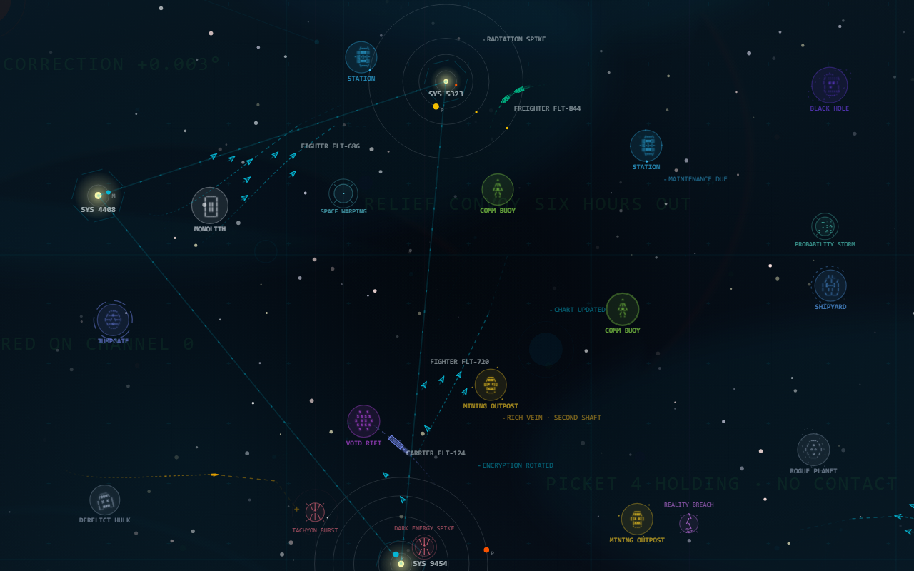
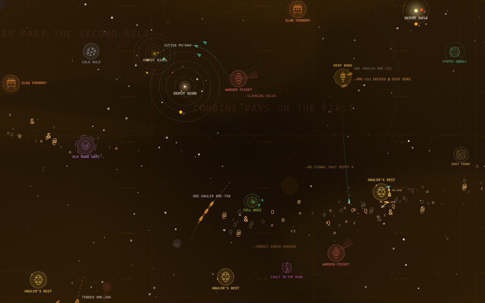
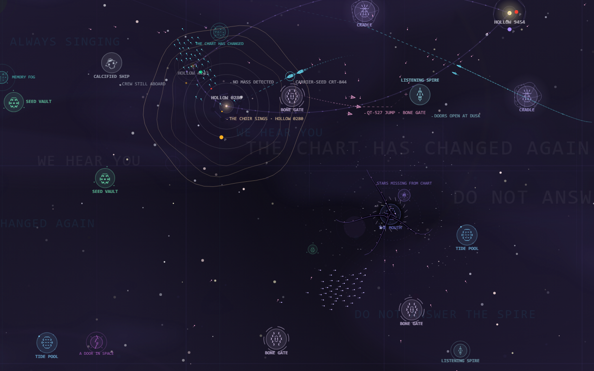
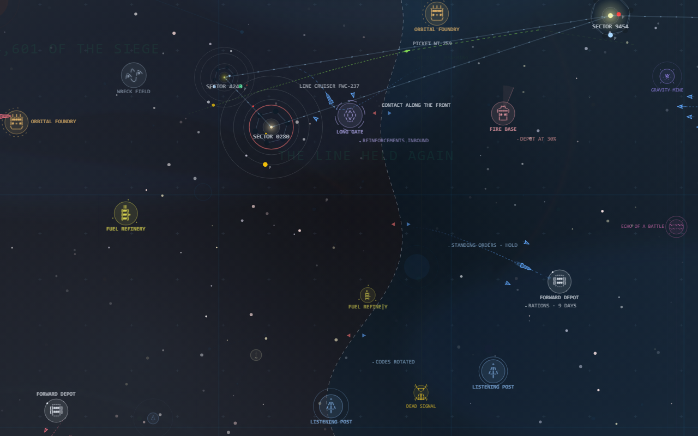
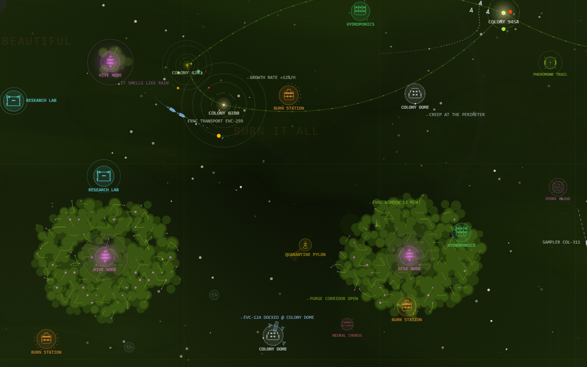
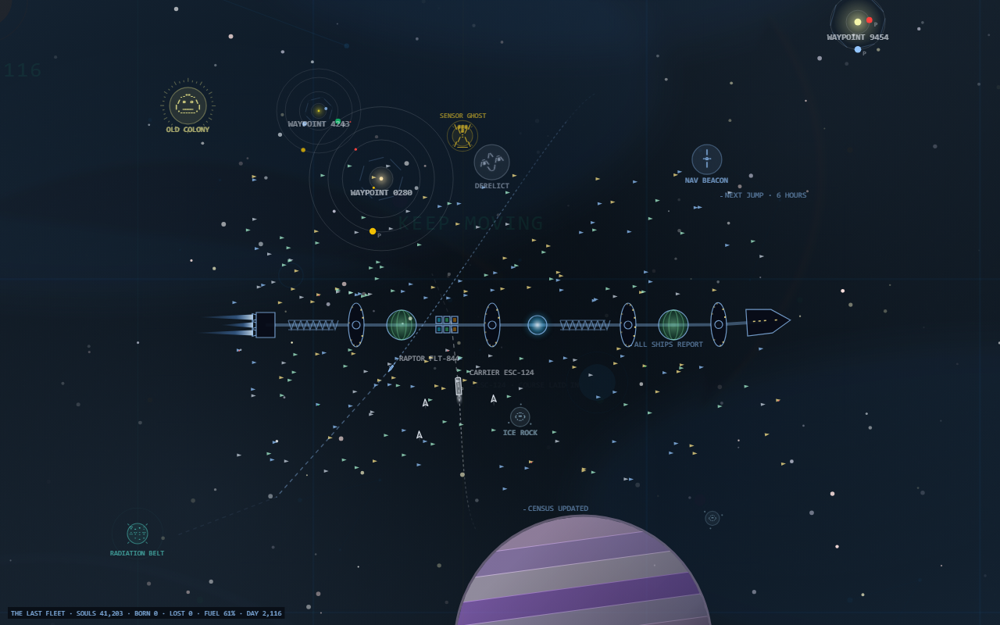
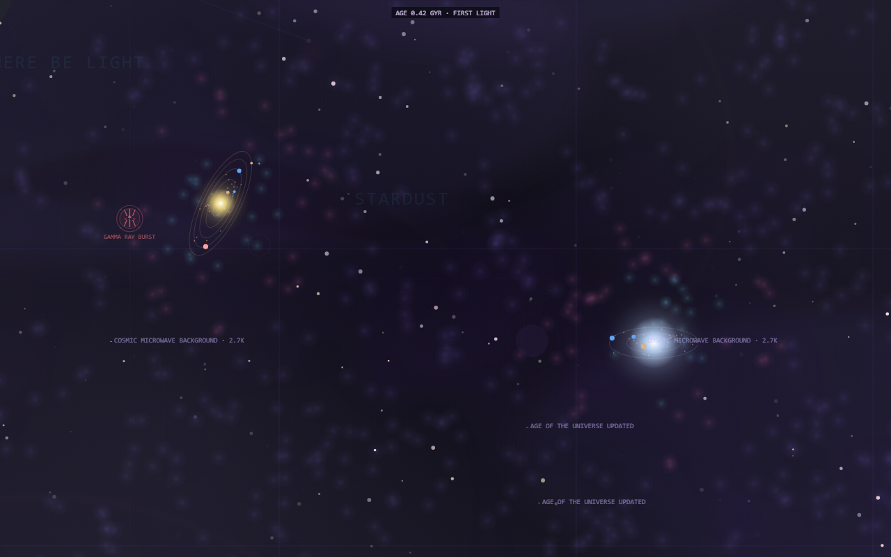
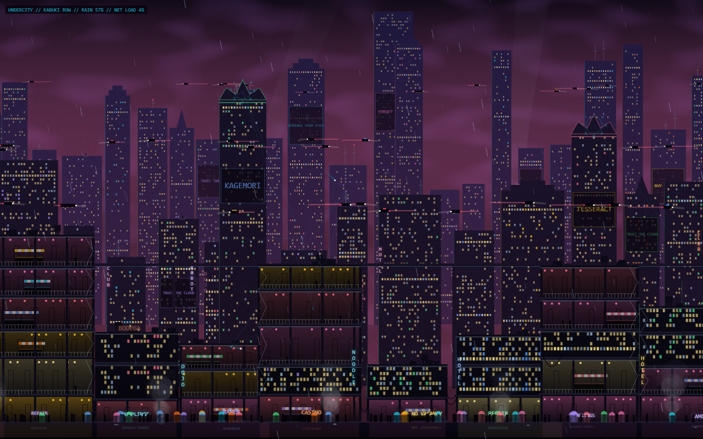

# Aesthetic Background Engine

A fun little thing I made to test one idea: what if a website's background wasn't decoration, but a working display from somewhere else?

**[Open the studio →](https://aesthetic-backgrounds-library.vercel.app)**



## The sector map

A living tactical chart of a stretch of space:
- **Fleets.** They fly in formation between structures that actually do things, some on the main plane and some deep behind it.
- **An economy.** Mines dig ore, docks refine fuel and parts, and habitats grow food. When a station runs short, a convoy carries the goods over in glowing pods, and shipyards build only from what they hold. Prices tick in the corner.
- **Gates, police, relays.** Paired gates queue ships, scan them for the toll, and pass them through a visible throat. Raids bring interceptors scrambling from the nearest defense platform. Messages and distress calls travel the relay network as light.
- **A camera with a director.** Now and then it leans in on whatever is happening: a raid, an armada, a capture.
- **Courses.** Each fleet's planned course is drawn ahead of it and its real trail behind, as one continuous line.
- **Anomalies.** They pulse in their own colors, and scouts go out to survey them.
- **Chatter.** Radio lines type themselves out next to whatever they're about.
- **Target lock.** Every half minute, brackets close on a contact while its data types out.
- **Pacing.** A slow tension curve gives the sector quiet stretches and busy ones.

The same seed always plays the same story. The seed is in the URL (`?seed=orion-harbor-23`), so a link is that exact world.

## Make it your universe

The map can belong to any world. A *universe pack* is a small JSON file holding the names, factions, ship classes, structures and their ASCII art, anomalies, radio chatter, and the faint words drifting in the background. You don't write it yourself:

1. In the studio, open **Universe → Make your own** and type a book, a film, a game, your tabletop setting, or a few lines about a world.
2. Click **Copy the prompt** and paste it into any AI.
3. Paste back what it writes, and the map becomes that world.

Six hand-written packs come with it, and each one plays differently, not just in other colors:
- **Saltwind Reach** is a poor mining frontier at the end of an old road. Belts of rock orbit across the map, and stray rocks collide and shatter. Miners cut ore, argue over claims, and haul ore home in their pods. Warden buoys stop and scan ships, and smugglers bolt with cutters behind them. Dust fronts blow through: beams go dark, miners run for the docks, and loose rock drifts on the wind. Now and then a bore blows out.
- **Choir of Hollow Stars** is a region where every star has been emptied and something sings inside. A song that reaches another hollow star makes it answer, and the chorus spreads. Leviathans migrate through. The Mouth reaches for ships with tendrils, feeds, and exhales new stars. Cradles hatch ships that grow as they fly. A circle of the map sometimes replays its last seconds as ghosts. Words in the background rearrange themselves, an eye opens in the dark and follows your pointer, and now and then a star goes out for good.
- **The Long Siege** is a war that has gone on longer than anyone has been alive. The camera travels along the front, which is held hex by hex. Long-held edges have hardened into walls, and a heat map shows where ground keeps changing hands. Each side saves up and then launches offensives. Supply convoys run to the line while the enemy hunts them, and a starved line gives way. Spotters paint targets before artillery arcs in, siege monitors duel across the line, fortress shields ripple and fail, and minefields go off in chains. Now and then a truce holds: medical ships cross no-man's-land, and the memorial beacon counts the names.
- **Hive Bloom** is a colony world where something is growing over everything, and it is beautiful. The creep is a cellular automaton that spreads from pulsing hive nodes, reaching for colonies with tendrils. Structures it covers turn to biomass glyph by glyph, and colonies evacuate first. Spore flocks swirl out and seed new growth. Purge fleets burn it back with flame cones and leave ash, and now and then a scourge burns out a node.
- **The Last Fleet** is everyone left alive, moving together. An enormous ark of linked hulls crosses the map: habitat rings with windows going round, farm domes, a reactor, engines trailing plumes. Hundreds of small ships keep station around it. Stragglers fall behind and tugs go back for them. Pursuers jump in at the trailing edge, and escorts break off to meet them. Skimmers dive to gas giants for fuel, children are born aboard, and the fleet counts its souls.
- **Cradle of Suns** is a cosmic time-lapse, a billion years every minute and a half. Gas collapses and stars ignite with jets and wind bubbles. Disks clump into planets, and planets light up with cities and launch their first ships. Ships found colonies and make first contact. Sometimes the lights go out, and massive stars die as supernovae that give their gas back. The age of the universe and the name of the era run along the top.

| | |
| --- | --- |
|  |  |
|  |  |
|  |  |

### What happens here

What makes a universe play differently is its *mechanics*: small plugins that spawn fleets, steer them, fight, break things, and draw on the map. A pack lists the ones it runs and how they're tuned, and in the studio, under **What happens here**, you can switch any of them on or off and tune them for the world you're looking at. Built in: raids, great events (armadas, flares, gate surges), an economy, police, gates, relays, asteroid mining, wardens, storm fronts, singing stars, murmurations, the Mouth, leviathans, echoes, cradles, a living chart, a front held cell by cell, spotted artillery, monitor duels, truces, minefields, a creeping bloom with spores and purge fleets, an ark with its flotilla, pursuers and fuel skimmers, and the lives of stars and the civilizations around them.

Writing a new one takes a few dozen lines:

```ts
import { registerMechanic, steerToward } from 'space-background-engine/skins/void-tactical';

registerMechanic({
  id: 'patrol',
  label: 'Patrols',
  description: 'Fighters warp in at one structure and sweep to another.',
  schema: { rate: { type: 'number', min: 0.1, max: 2, default: 0.5, label: 'Per minute' } },
  create(api, p) {
    let next = api.t + 5;
    return {
      update() {
        const [a, b] = api.structures();
        if (api.t < next || !a || !b) return;
        next = api.t + 60 / Number(p.rate);
        api.spawnFleet({ x: a.x, y: a.y, vx: 0, vy: 0 }, {
          cls: 'fighter',
          warpIn: true,
          steer: (f, dt) => {
            steerToward(f.ships[0], b.x, b.y, 110, 6, dt);
            if (Math.hypot(b.x - f.ships[0].x, b.y - f.ships[0].y) < 30) api.release(f);
          },
        });
      },
    };
  },
});

mount(document.body, { skin: 'void-tactical', options: { universe: 'saltwind', mechanics: [{ use: 'asteroids' }, { use: 'patrol' }] } });
```

`options.mechanics` replaces the pack's own list; leave it out to keep the pack's.

## Undercity



A cyberpunk city at night, in the rain, in 2.5D. Three parallax layers drift past: a far skyline of megatowers with blinking masts and searchlights in the smog, mid towers with corp data fortresses and holo ads, and a near megastructure cut open. Its stacked levels show terraces and markets under lanterns, stairs, cables, and shopfronts above a wet street that reflects the neon. Flying cars stream between the layers in lanes of light. Maglev trains pass. Crowds walk under neon umbrellas, steam rises, and lightning is followed by thunder.

Over all of it runs the net. A netrunner jacks in from an apartment, and a trace runs hop by hop to a corp tower, where the ICE wakes in a ring of glyphs. A breach glitches the tower, hijacks its ads, and sometimes kills the district's grid block by block. A flatline brings the police with searchlights. A terminal readout keeps the log.

```ts
mount(document.body, { skin: 'undercity', options: { rain: 1, net: 1.5 } });
```

The city is a lazy chunk (about 14 KB gzip) that loads the first time it mounts. `space-background-engine/skins/undercity` registers it on its own, for a page that wants only this.

## Instruments from other worlds

The same idea applied to other screens.

| | |
| --- | --- |
|  **Sonar.** A submarine's passive waterfall. Contacts drift across bearings and whales sing on and off. Then a torpedo is in the water: the boat turns hard and every trace bends with it, a decoy blooms, and the torpedo veers off to it. Sometimes the boat goes active and the contacts answer. |  **Approach radar.** The sweep paints aircraft onto fading phosphor. Arrivals hold, land, or go around, departures climb out, helicopters and light aircraft wander low, conflict alerts blink, and now and then someone declares an emergency and squawks 7700. |
|  **Seismograph.** Station pens tremble until a quake's waves sweep down the stack. Big ones shake the record and bring aftershock sequences. There are also quarry blasts, a volcano's harmonic tremor, and great quakes from the far side of the planet that reach every station at once. |  **Abyssal scanner.** Marine snow and bioluminescent animals. A startled jelly's alarm flash runs through its neighbors, a dragonfish hunts by red light and scatters a school, shrimp spit glowing clouds, and the seafloor rises into view over a vent field. Something very large crosses the edge of the light. |
|  **Martian weather radar.** Dust storm cells drift over Jezero. A rover drives and cores samples while a helicopter scouts ahead, orbiters pass over to relay, meteors leave fresh craters, a lander comes down, and storm watches park everything. All of it goes into the ops log. | |

## Put one on your site

Open the [studio](https://aesthetic-backgrounds-library.vercel.app), pick one, and click **Copy prompt for your AI**. Paste it into Claude, ChatGPT, Cursor, or v0. The prompt carries the exact configuration and the few rules that keep it right.

To do it by hand instead:

```ts
import { mount } from 'space-background-engine';

mount(document.body, { skin: 'void-tactical', seed: 'orion-7', options: { universe: 'saltwind' } });
```

Everything is seeded and deterministic. It respects reduced motion, pauses when the tab is hidden, and is dark enough behind a text column to keep body copy readable.

### Sound, if you want it

The sector map can be heard as well as seen. It's opt-in and generated, with no audio files, and adds about 5 KB:

```ts
import { createSoundscape } from 'space-background-engine/audio';

const sound = createSoundscape({ palette: 'choir' });
sound.attach(handle);
playButton.onclick = () => sound.start();
```

Explosions boom where they happen across the screen. Raids bring a siren, a captured system rings a bell, and the Choir's songs are low voices answering each other. Each universe has its own palette and drone.

## Running it

```bash
pnpm install
pnpm dev
```

The studio opens at `localhost:5174`. How it all works, the API, and the smaller "basics" backgrounds are in [docs/REFERENCE.md](docs/REFERENCE.md).
