<h1 align="center">Vivarium</h1>

<p align="center">
  <b>Small worlds that run behind a web page.</b><br>
  Living algorithmic art. An idle game that plays itself.
</p>

<p align="center">
  <a href="https://aesthetic-backgrounds-library.vercel.app"><b>Open the studio →</b></a>
  &nbsp;·&nbsp; <a href="#put-one-on-your-site">Put one on your site</a>
  &nbsp;·&nbsp; <a href="#the-worlds">The worlds</a>
  &nbsp;·&nbsp; <a href="#reference">Reference</a>
</p>

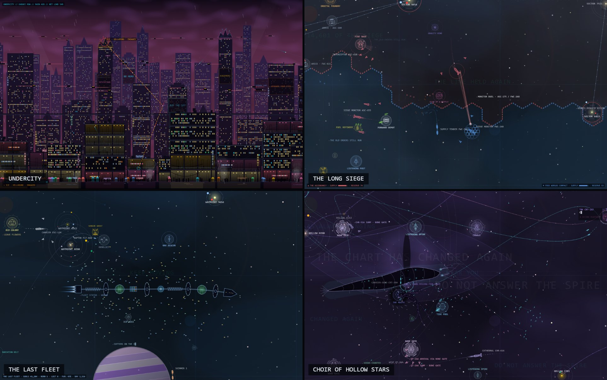

Vivarium is a set of animated backgrounds for websites. They are not loops. Each one is a small simulation with its own rules, and the rules make things happen.

A war room tracks a front that has not moved in forty years. A city in the rain loses its power one block at a time. Dwarves dig a kingdom into a mountain. Mages raise towers on lines of power. A wyrm sleeps on a spire above a valley, until it wakes.

You can read it two ways:
- **Living algorithmic art.** Generative pieces that do not stop or repeat. The same seed always plays the same story, so a link is an exact world.
- **An idle game with no player.** Economies, sieges, harvests, and wars run on their own. Watch for a minute, or leave the tab open for a week and look back at what happened.

It is also an experiment. Most of the code here was written with frontier AI coding agents, one world at a time. Each world is a hard brief: a simulation, a renderer, pacing, sound, and taste, all in one file tree. It is a fun way to see what the models can do, and where they still fail.

The worlds still behave like backgrounds:
- They keep the text over them readable.
- They pause when the tab is hidden, and calm down under reduced motion.
- They stay small. The engine is about 16 KB, and each world loads only when it is shown.

<details>
<summary><b>Contents</b></summary>

- [Things happen](#things-happen)
- [The worlds](#the-worlds): [the sector map](#the-sector-map), [six more universes](#six-more-universes), [Undercity](#undercity), [Shieldwall](#shieldwall), [Ages](#ages), [the War Table](#war-table), [Wyrmspire](#wyrmspire), [Deephold](#deephold), [Leylines](#leylines), [instruments](#instruments-from-other-worlds), [basics](#basics)
- [Make it your universe](#make-it-your-universe) and [what happens here](#what-happens-here)
- [Sound](#sound), [the journal](#the-journal), and [wallpapers](#as-your-wallpaper)
- [Put one on your site](#put-one-on-your-site)
- [Reference](#reference):
  - Setup: [installation](#installation), [presets](#presets), [frameworks](#frameworks), [the CLI](#copy-a-background-into-your-project), [community presets](#community-presets), [palette tokens](#palette-tokens-on-your-page)
  - Engine: [configuration](#configuration), [guarantees](#what-the-engine-guarantees), [scenes and layers](#scenes-and-layers), [light and transitions](#light-quiet-zones-moments-transitions), [events and sound](#events-and-sound)
  - Skins: [the sector map's options](#the-sector-maps-options), [Undercity's options](#undercitys-options)
  - Building on it: [AI agents](#using-it-with-an-ai-agent), [writing your own skin](#writing-your-own-skin), [local development](#local-development)

</details>

## Things happen

Every world has its own events, not just its own colors. Here are a few, frame by frame.

**Undercity.** A runner breaches a corp tower, and the district's grid fails outward from it, block by block.

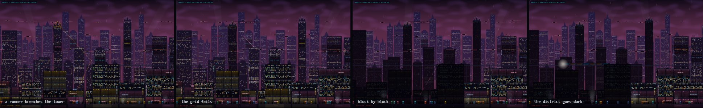

**The Long Siege.** Two siege monitors trade broadsides across the front, and hex shields light up where the beams land.

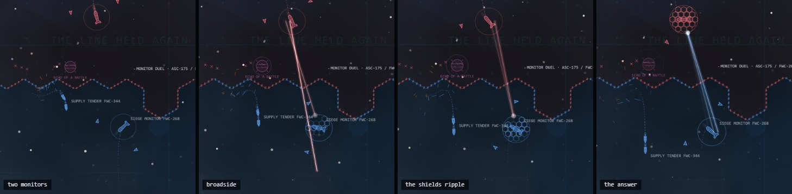

**Hive Bloom.** A purge fleet lights its torches and burns the creep back to ash. It will grow back.

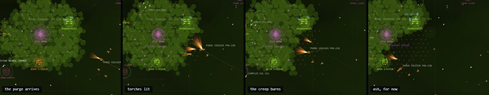

**Cradle of Suns.** A massive star dies, and its shell carries the gas back out to make the next ones.

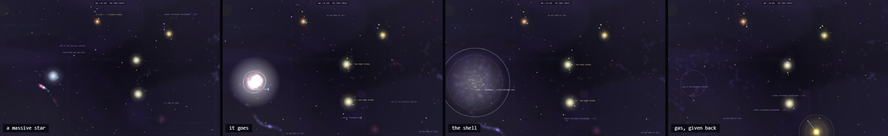

## The worlds

### The sector map

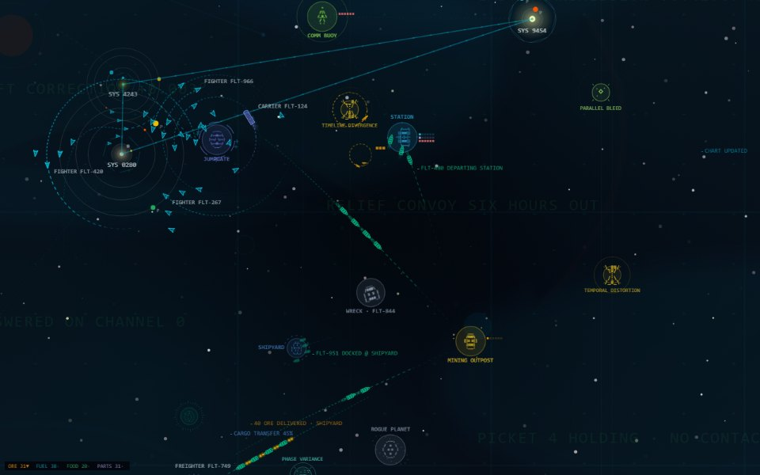

A living tactical chart of a stretch of space:
- **Fleets.** They fly in formation between structures that actually do things. Some fly on the main plane and some deep behind it.
- **An economy.** Mines dig ore, docks refine fuel and parts, and habitats grow food. A station that runs short gets a convoy, with the goods glowing in its pods. Shipyards build only from what they hold, and prices tick in the corner.
- **Gates, police, relays.** Paired gates queue ships, scan them for the toll, and pass them through a visible throat. Raids bring interceptors scrambling from the nearest defense platform. Messages and distress calls cross the relay network as light.
- **A camera with a director.** Now and then it leans in on whatever is happening, such as a raid, an armada, or a capture.
- **Courses and chatter.** Each fleet's planned course is drawn ahead of it, and its real trail behind. Radio lines type themselves out next to whatever they are about. Every half minute, brackets close on a contact while its data types out.
- **Pacing.** A slow tension curve gives the sector quiet stretches and busy ones.

The seed is in the URL (`?seed=orion-harbor-23`), so a link is that exact world.

### Six more universes

The map can belong to any world. A *universe* holds the names, factions, ship classes, structures and their ASCII art, chatter, and the faint words drifting in the background. It also decides **what happens there**. Six hand-written ones come with it, and each plays differently:

<table>
<tr>
<td width="48%">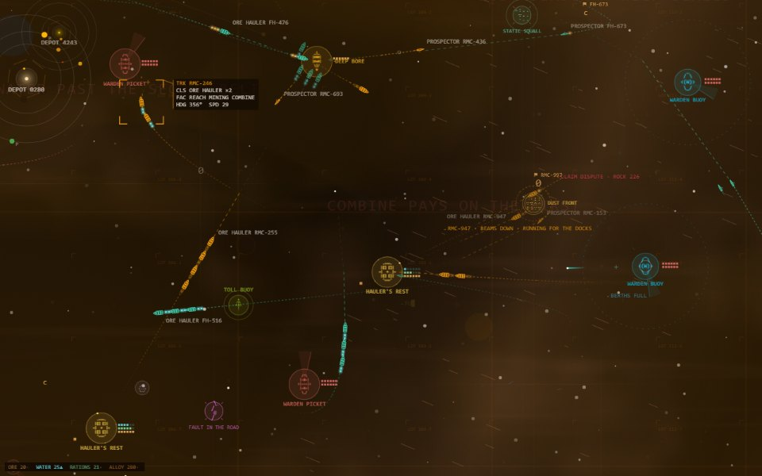</td>
<td><b>Saltwind Reach</b><br>A poor mining frontier at the end of an old road. Belts of rock orbit across the map, and stray rocks collide and shatter. Miners argue over claims and haul ore home in their pods. Warden buoys scan ships, and smugglers bolt with cutters behind them. When a dust front blows through, beams go dark and everyone runs for the docks.</td>
</tr>
<tr>
<td>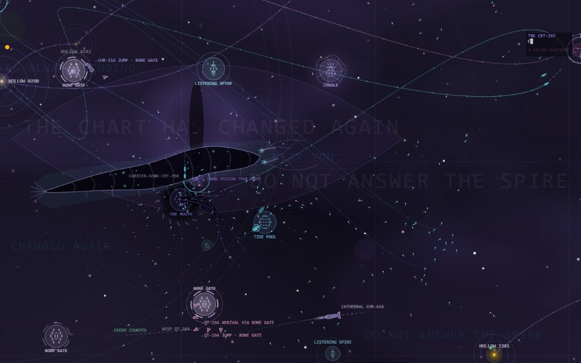</td>
<td><b>Choir of Hollow Stars</b><br>Every star here has been emptied, and something sings inside. A song that reaches another hollow star makes it answer, and the chorus spreads. Leviathans migrate through, and the Mouth reaches for ships with tendrils. The words in the background rearrange themselves. An eye opens in the dark and follows your pointer, and now and then a star goes out for good.</td>
</tr>
<tr>
<td>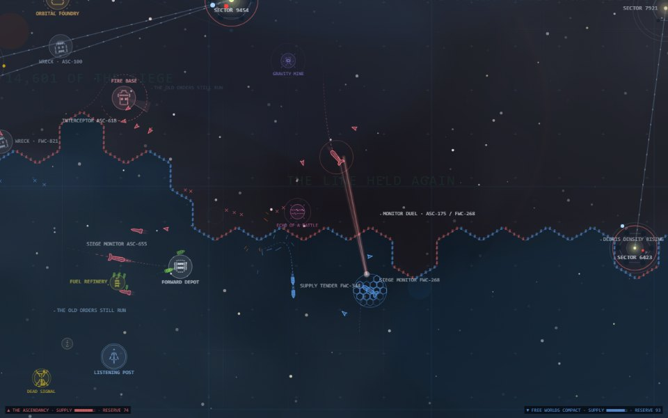</td>
<td><b>The Long Siege</b><br>A war older than anyone fighting it, held hex by hex along a front the camera travels. Each side saves up and then attacks, and supply convoys run to the line while the enemy hunts them. Spotters paint targets before the artillery arcs in, monitors duel, and minefields go off in chains. Now and then a truce holds, and the memorial beacon counts the names.</td>
</tr>
<tr>
<td>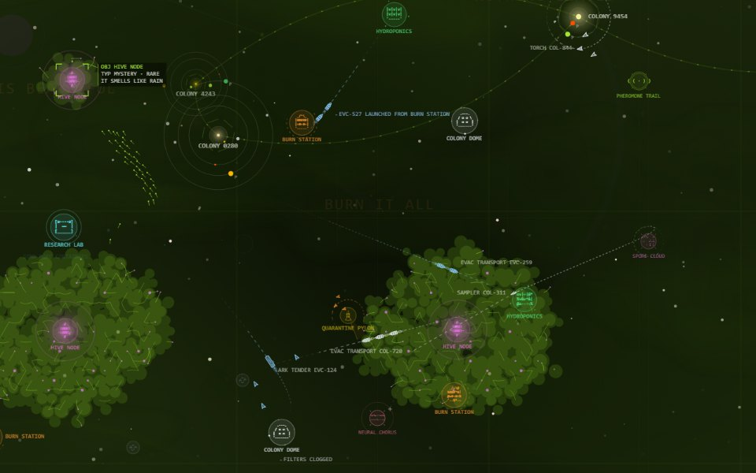</td>
<td><b>Hive Bloom</b><br>Something is growing over the colonies, and it is beautiful. The creep is a cellular automaton that spreads from pulsing hive nodes, and the structures it covers turn to biomass glyph by glyph. Spore flocks swirl out to seed new growth. Colonies evacuate, and purge fleets answer with fire.</td>
</tr>
<tr>
<td>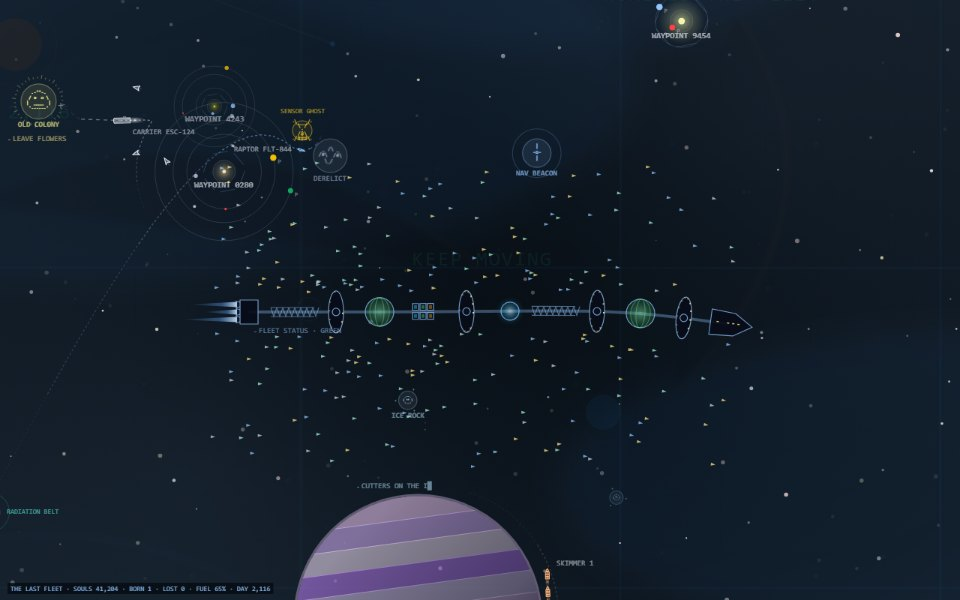</td>
<td><b>The Last Fleet</b><br>Everyone left alive, moving together. A twelve-segment ark crosses the map, with habitat rings whose windows go round, farm domes, and engines trailing plumes. Hundreds of small ships keep station around it. Stragglers fall behind and tugs go back for them, pursuers jump in at the trailing edge, and skimmers dive into gas giants for fuel. Children are born aboard.</td>
</tr>
<tr>
<td>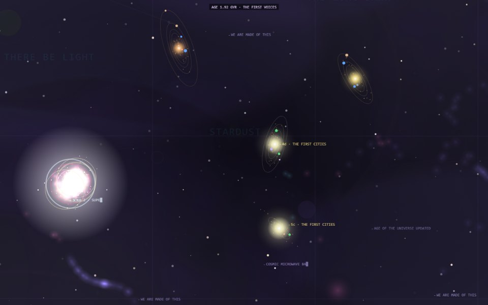</td>
<td><b>Cradle of Suns</b><br>A cosmic time-lapse. Gas collapses, and stars ignite with jets and wind bubbles. Disks clump into planets, and planets light up with cities and send out their first ships. Then come colonies and first contact, and sometimes silence. The age of the universe runs along the top, in billions of years.</td>
</tr>
</table>

### Undercity

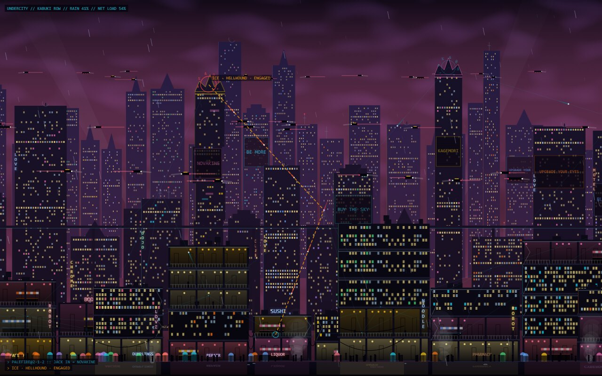

A cyberpunk city at night, in the rain, in 2.5D. Three parallax layers drift past:
- a far skyline of megatowers, with blinking masts and searchlights in the smog
- mid towers, with corp data fortresses and holo ads
- a near megastructure cut open: terraces and markets under lanterns, stairs, cables, and shopfronts over a wet street that reflects the neon

Flying cars stream between the layers in lanes of light. Maglev trains pass, crowds walk under neon umbrellas, and the thunder comes a moment after the lightning.

Over all of it runs the net. A netrunner jacks in, and a trace runs hop by hop to a corp tower, where the ICE wakes in a ring of glyphs. A breach glitches the tower, hijacks its ads, and can take the district's grid down. A flatline brings the police with searchlights.

```ts
mount(document.body, { skin: 'undercity', options: { rain: 1, net: 1.5 } });
```

### Shieldwall

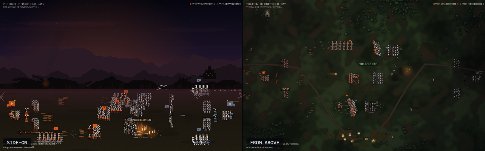

Pitched battles between peoples, in pixel sprites drawn by code. Four peoples, each with its own look, its own magic, and its own way of fighting:
- **a kingdom** of steel and banners, whose mages raise wards against arrows and call sunfire
- **a horde** riding wolves, whose shamans throw fire
- **a fey host** of longbows on elk, whose mages call lightning
- **a hollow legion** of the dead on bone horses, whose necromancers raise the fallen to fight for them

A battle has a story. The armies muster, and sometimes the two lords ride out to duel between the lines. Archers loose volleys that arc across the sky, and trebuchets throw stones. Then the lines advance in ragged blocks and meet, and the horse charges the flanks. A lord rides to a wavering regiment and rallies it, or falls. Morale breaks, a side routs, and the victors hold the field while the crows come down. Days later there is another battle. A war is the best of five, and then a new war begins between new peoples.

Now and then a dragon descends on both armies. It breathes fire along the ranks, and the bows and mages of both sides turn on it. About a third of the time, it falls.

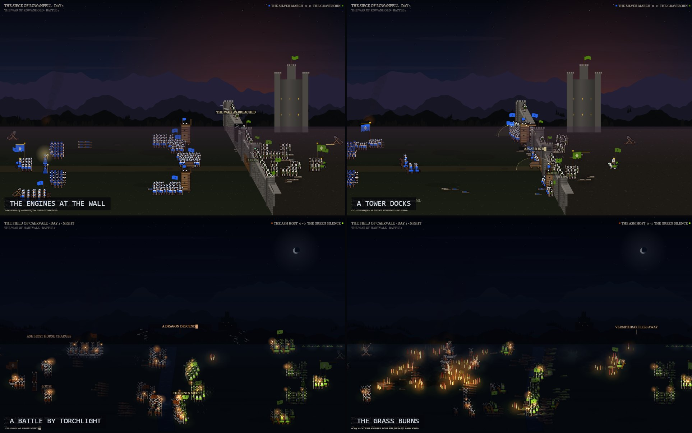

Some battles are sieges. One side holds a walled town, with bows and mages on the wall and a keep behind it. The other side rolls up siege towers and a ram and throws stones until a stretch of wall comes down. Men can cross only where there is a way over: a broken gate, a breach, a tower's bridge, or a ladder (ladders get thrown down). The defenders' foot go to whichever gap opens and hold it. A siege that drags on is given up.

The ground matters too:
- **A hill** gives its holders range for their bows and the downhill blow.
- **A ford** slows whoever is in the water.
- **A wood** at the far edge can hide horsemen, who come out on the flank in the middle of the fight.
- **Dry grass** catches from fire magic and dragonfire, and the fire runs with the wind.

Each side has a standard. Where it flies, the line holds better. If it falls, the wing near it wavers, and sometimes someone takes it up again. The lord's guard goes in when the fight has gone on, or when the line gives.

At night the field is dark but for torches in the ranks, spells, fires, and magelight hung over the enemy. Afterwards the field remembers: the earth is worn where the fighting was, banners lie in the mud, the victors plant theirs, and people come out of the woods to walk among the fallen.

```ts
mount(document.body, { skin: 'shieldwall', options: { view: 'above', dragons: 2 } });
mount(document.body, { skin: 'shieldwall', options: { battles: 'siege', weather: 'night' } });
```

Two ways to watch: `view: 'side'`, a field under a moody sky with mountains, a keep, and camps on the ridge; or `view: 'above'`, the same war as a map at dusk, with woods, a village with its fields and mill, a river and its bridge, and the armies in blocks.

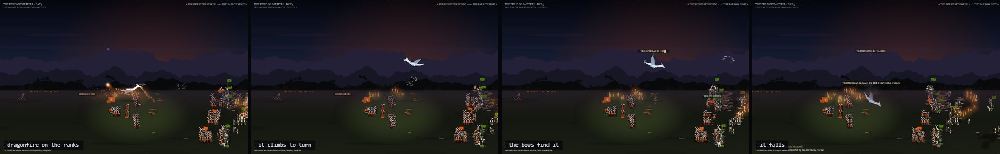

### Ages

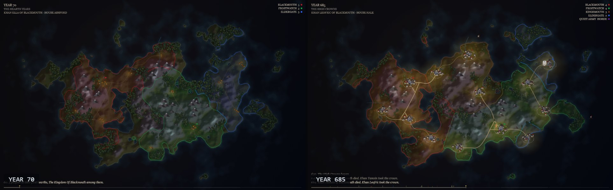

A thousand years of a continent, from above, at dusk. A few peoples light their first hearths. Their settlements grow with the food of the land around them, from hamlet to village, town, city, and capital, and send settlers walking out to found new ones, with roads behind them. Each kingdom's land is its towns' reach, washed in its color, with a border that wanders the way real ones do. The land is drawn from its own height and wetness: hillshade, shallows, a traced coastline, rivers that meander and widen downstream, woods where it is wet, and peaks on the ridges.

Neighbors grow tense along long borders, and in time there is war: armies march along the roads, meet in the field, and sit down outside walls for years. Towns change hands and kingdoms fall. Plague travels the roads. Hordes come out of the wild, and sometimes take a town and settle. Kingdoms grown too big split in civil war, and now and then a dragon wakes in the mountains. When the last era ends, the age ends, and a new land rises.

The ages show in the towns:
- **Eras turn every couple of centuries**, from the Hearth Years to the Lamp Age, and the towns are rebuilt in each one: round huts and palisades, then timber, then stone houses under red roofs, church spires, palaces, and star forts with moats. Ships go from oared galleys to cogs to tall ships.
- **Dynasties:** every kingdom has a ruling house and a ruler, and reigns end. An heir takes the crown, or the house dies out and a new one takes the throne, and a big realm may split over it in a war of succession.
- **Trade:** caravans walk the roads between friendly towns, and ships sail between ports. Rich towns grow past what their own fields could feed, and the busiest roads wear wider.
- **Wonders take a lifetime.** A great city begins one, and it rises for decades under scaffolding and a crane: a lighthouse that turns its beam, a cathedral, hanging gardens, a colossus, a library, a stepped stair of kings, an observatory.
- **The land changes:** woods around the growing towns are cleared for fields, volcanoes wake and bury the towns below in ash, and rivers flood.
- **A ribbon of history** runs along the bottom of the map: the eras, a mark for every war, plague, wonder, and fallen house, and where the age is now.

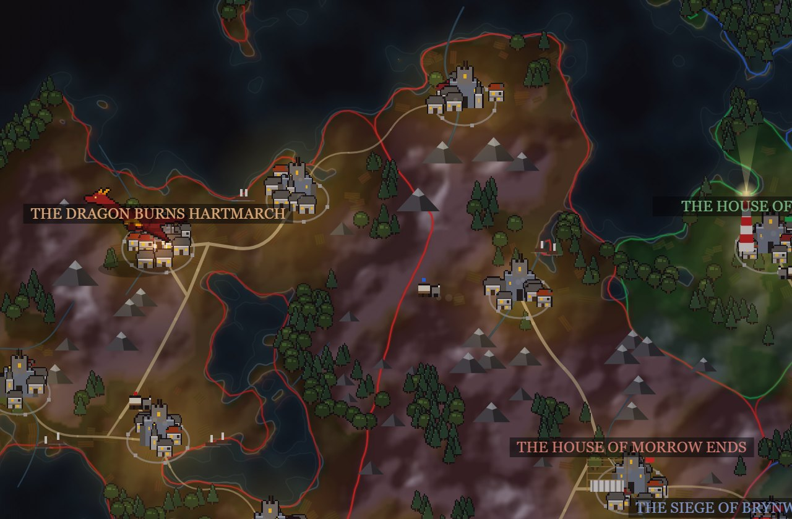

```ts
mount(document.body, { skin: 'ages', options: { speed: 1.5, kingdoms: 6 } });
```

### War table

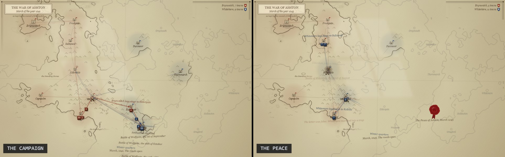

One war's campaign, played out on a parchment map by a hand you never see. The map is drawn in ink: a coast with contour ripples, hatched hills, little woods, dotted roads, castle towns with their names in an italic hand, a compass rose, and a serpent noted in the margin. Two or three realms wash their towns in watercolor.

Each month the orders go out. An arrow is drawn in ink, and then a painted wooden token, stacked by strength and carved with a sword, a horseshoe, or a crown, slides along it. Tokens that meet fight, and the loser falls back or is tipped over. A token left at an enemy town lays siege, and the days are counted in ticks around it until the town falls and its pennant changes color. Battles leave crossed swords and a note with the date, and some towns burn. In winter, frost creeps in from the edges and the armies go into winter quarters. When a realm loses its seat, or everyone is worn out, the peace is sealed in red wax, and the next campaign is unrolled.

There is more on the table than the war:
- **Dispatches.** Sealed letters ride out from each seat to its armies, a dotted line behind them, and are opened when they arrive. A rider who passes too near the enemy may be taken: the seal is broken, the letter read, and the enemy moves on the army it was for. Now and then a letter is a forgery under a stolen seal, and the army that obeys it marches into a trap.
- **The fog of war.** The map is kept by one realm's war council. Around its towns, its armies, and the enemy towns its scouts watch, the map is in ink; beyond that it is bare paper with the coast and towns sketched in pencil, and enemy armies are only where they were last reported, a pencilled square with a question in it.
- **The light of the seasons.** Window light drifts across the table, the mullions' shadow through it: cold and small in winter, fresh in spring, long and golden in summer, amber in autumn, when a few leaves blow in.
- **An old map's furniture:** a double frame and a scale of leagues, rhumb lines from the compass rose, rivers, named peaks, woods, and seas, a witch's tower, ruins, standing stones, a barrow, a kraken and a whale, a wind's head blowing across the sea, and each realm's arms on a shield in the legend.

It is the one light-themed world: dark ink on parchment, legible under dark text.

```ts
mount(document.body, { skin: 'war-table', options: { realms: 3 } });
```

### Wyrmspire

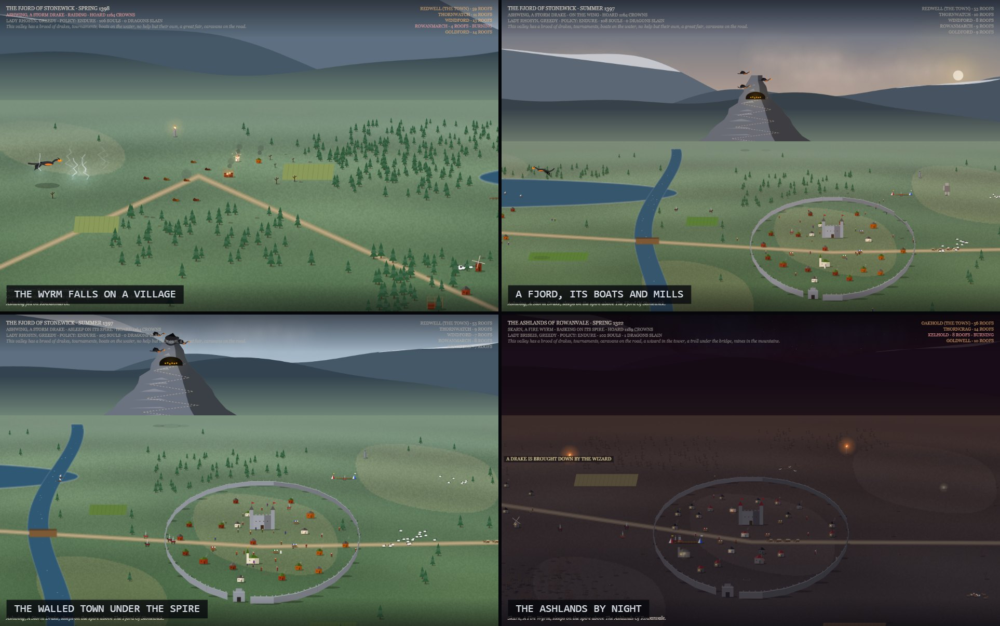

A valley seen in depth from a hillside, wider than the screen. At its far end a spire of rock rises with a cave high in it, a path cut up its face, and the wyrm coiled on top with its brood on the ledges.

The valley is full and busy at any speed:
- a walled town under its castle, with its church, inn, smithy and market
- villages with their fields and windmills, a river and its bridge, forests, pastures and herds, and watchtowers on the hills
- farmers plough, tend and reap with the seasons and cart the sheaves to the granary
- woodcutters fell trees and haul the logs, and builders keep raising houses, churches, granaries, mills, palisades and ballista towers
- shepherds, merchants, caravans, guards on the walls, knights at the lists, and priests at the church

The wyrm basks, patrols and hunts the herds, and its drakes take cattle and harry the villages. When its wrath is up it raids. The beacons are lit from hill to hill and the bells ring, and the people run for the walls. Its breath burns, freezes, calls lightning, withers or darkens, by breed. Fires spread from roof to roof until the bucket chains put them out, and the ruins are rebuilt. Archers loose, ballistae throw their bolts, and the knights ride out.

The lord answers by temper: endure, fortify, pay tribute (carts to the foot of the spire), or hunt. Heroes ride in, feast, and climb the spire path to the cave; thieves go up by night for the hoard.

Each seed draws its land (alpine, fjord, red canyon, fen, ashlands) and breed, and a cast: the brood (drakes, a clutch of eggs, or the wyrm alone), foes (a rival wyrm to fight over the valley, a hill giant, a troll under the bridge), pageants (tournaments, a great fair, pilgrims), trade (mines, boats, caravans), the land's own hazards (avalanches, a smoking mountain, floods), and help (griffon riders, a wizard in his tower). The first version, through a watchtower's spyglass, is `style: 'classic'`.

```ts
mount(document.body, { skin: 'wyrmspire', options: { valley: 'fen', wrath: 2 } });
```

### Deephold

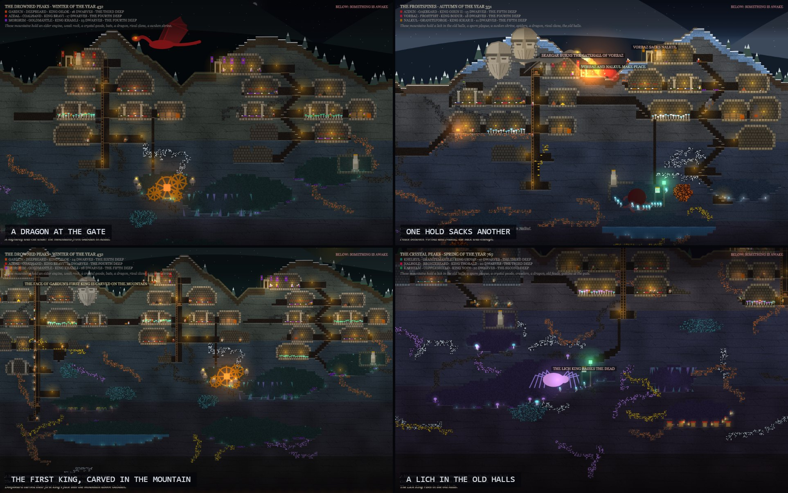

A range of mountains cut through like a glass ant farm, wider than the screen, with two to four dwarf holds inside it, each its own clan with its own banner, king, and way of building:
- how it goes down: ladder shafts, a lift riding its ropes, or flights of stairs that zigzag from deep to deep
- how it carves its rooms: arched, domed, tiered, or vaulted, lined in its own dressed stone or left raw
- how it lights them: torches, braziers, crystal lamps, or lava run in channels
- whether it lays rails, and how many statues of its kings it raises

The holds never stop building. Each has an endless plan: deeper levels, rooms as the clan needs them (storerooms, dormitories, farms, breweries, forges, great halls, temples, tombs, barracks, treasuries, pumps, halls of records), mines along the veins, vaulted halls and galleries of kings, its first king's face carved on the mountainside, and highways under the mountains to the next hold, bridged where they cross a cavern. Dwarves dig fast enough to watch; haulers push carts of ore; smiths, brewers, farmers and masons work; they sleep in shifts and feast. Caravans and migrants come up the slopes, kings are crowned, and a smith in a strange mood forges an artifact.

The holds trade along the highways and fall out: a hold marches its soldiers through the tunnels to sack a rival's hall, then makes peace. A hold emptied falls, and another clan comes to retake it. A dragon comes over the peaks to burn a gate until the crossbows bring it down or it flies off.

Every seed is a different range with its own cast, drawn the way the sector map draws its mechanics:
- **What lies below** (one of these):
  - a sleeper, of many kinds and names, that stirs when they dig near and climbs the shaft
  - a lich in the old halls who raises the dead (the clan's own, from the tombs)
  - an elder engine that wakes and sends out golems
  - a hive queen who sends swarms
  - nothing at all but stone
- **Hazards:**
  - aquifers that flood a deep (the water flows, and pumps drain it)
  - magma that flows and cools to obsidian
  - weak rock that caves in
  - firedamp in the coal
  - a spore plague that spreads from dwarf to dwarf
- **Neighbors:** goblins at the gate, a goblin warren that raids from below, deep gnomes who come up to trade.
- **Wonders:** a crystal geode, a mithril lode, a sunken shrine, the halls of an older people, a black lake.
- **Life in the caverns:** spiders, crawlers, trolls, bats, glow-worms, mushroom folk.
- **The sky:** a dragon, or clear skies. **The clans' temper:** rivals quick to war, allies who trade, or old feuds.

The things below wake when the miners dig near them, break through to the holds, and send their own; they can be ended by the soldiers or wind down. The first version, a single hold under one mountain, is `style: 'classic'`.
```ts
mount(document.body, { skin: 'deephold', options: { mountain: 'ember', holds: '4', below: 'lich' } });
```

### Leylines

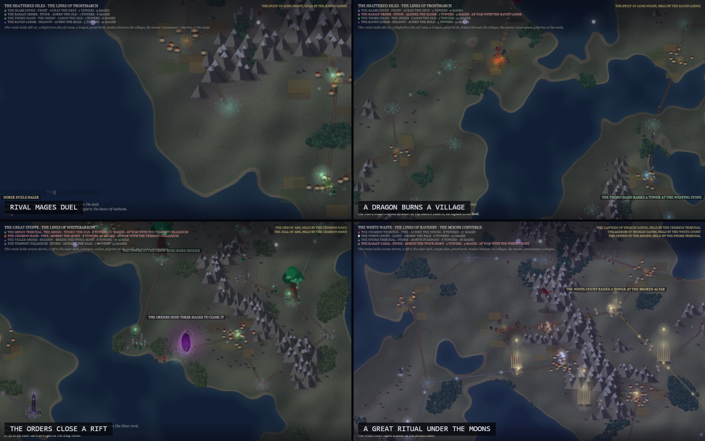

A realm seen from high up, wider than the screen, the way a mapmaker draws it: hills and snowcapped peaks, forests, lakes or sea, villages with their fields and roads, the ruins of an older age, and stone circles on the wells where the ley lines meet. Power runs along the lines into the towers built on them.

Orders of mages hold the wells. Each has a school (fire, frost, storm, the green, shadow, light, stone) that decides its spells and its summons, a tower style (spires, ziggurats, crystal clusters, great trees, obelisks), its colours, an archmage, and a temper. Their mages are out on the land all the time, walking the roads and the lines (storm mages ride the air):
- channelling at their wells
- going out to claim free wells and raising towers on them, stone by stone, then higher
- blessing villages, which grow
- searching ruins for artifacts, and sometimes waking what guards them

Rival mages who meet duel with their school's spells: fireballs, ice lances, lightning, vines, shadow bolts, beams of light, spikes of stone. The spells mark the land, burning the woods and leaving frost. Orders at war send war parties with summoned elementals to besiege a tower until its ward breaks and it falls, and its well is free to claim again. An archmage who falls is succeeded; an order that loses its last tower is gone, and a new one rises at a free well.

Every seed draws its land (a blend of isles, steppe, forest, desert, tundra, fens and peaks) and a cast:
- **Weather:** arcane storms whose lightning charges the towers, long rains, or still air.
- **Calamities:** a rift that pours out demons until the orders close it together, a falling star the orders race to, a blight creeping out of the ruins.
- **The sky:** a dragon that burns villages until the mages bring it down or drive it off, griffon riders, or empty skies.
- **Beasts and folk:** great herds, wolves, giants from the hills, pilgrims, traders between the villages.
- **The moons:** at their convergence an order gathers in a circle for a great ritual (a phoenix, a colossus, a forest raised in a night, a ward of light, a fall of stars). Some seeds also get eclipses.

The night is long and lit: tower windows and crystals, braziers, spells, the lines, the cottages. The light is cheap glow sprites, with no bloom pass. The ink network (`style: 'ink'`) and the first version (`style: 'classic'`) are still there.
```ts
mount(document.body, { skin: 'leylines', options: { land: 'mountains', orders: 5, scale: 1.5 } });
```

### Silent Running

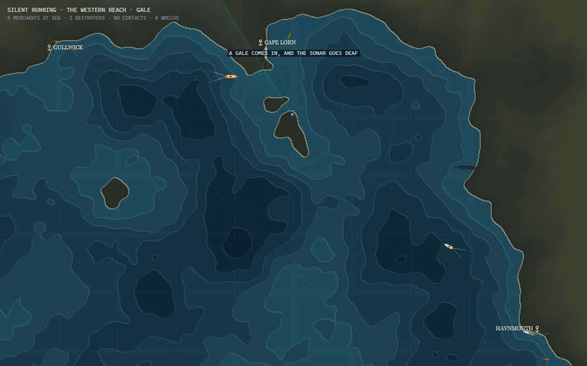

The sonar instrument, grown into a world: a sea at war, on the chart table of a listening station. The chart shows coasts and islands, depth bands, two to four ports, and the shipping lanes between them. The station's sweep turns over all of it.

Convoys of merchants and tankers sail the lanes from port to port, some with a destroyer as escort. Destroyers patrol and ping, and a ping can hear a submarine. Raiders are faint shapes under the water until they are heard. They stalk the lanes, come up to periscope depth, and fire on merchants. A destroyer that hears one hunts it: depth charges over the contact, a decoy, a lost contact, sometimes a kill. Sunk ships stay on the chart as named wrecks, with an oil slick that drifts. Whales migrate through the sound and sing, and now and then a destroyer mistakes one for a boat.

Each seed draws its sea (which coasts, which islands, which ports) and a cast: raiders, a wolfpack that gathers on the lanes, gales that make the sonar deaf, ice in the north, and, very rarely, something far too large for any boat passing under the lanes. A click drops a sonobuoy: it listens for half a minute, and if it hears a submarine, the nearest destroyer comes.
```ts
mount(document.body, { skin: 'silent-running', options: { traffic: 1.5 } });
```

### Instruments from other worlds

The same idea, applied to other screens.

| | |
| --- | --- |
| 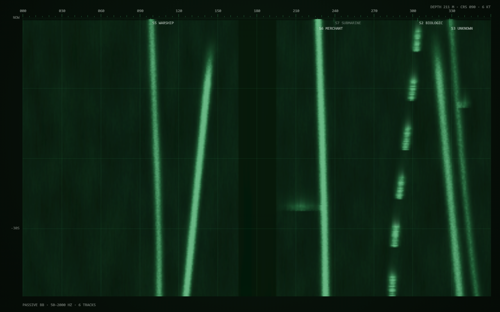 **Sonar.** A submarine's passive waterfall. Contacts drift across bearings, and whales sing on and off. Then a torpedo is in the water: the boat turns hard and every trace bends with it, a decoy blooms, and the torpedo veers off after it. | 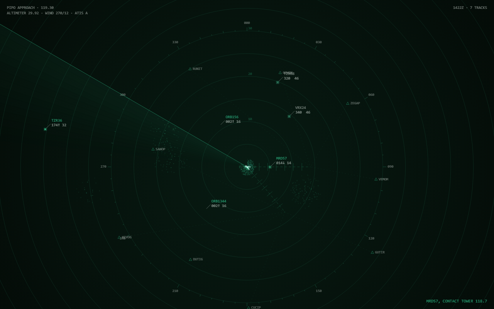 **Approach radar.** The sweep paints aircraft onto fading phosphor. Arrivals hold, land, or go around, departures climb out, and conflict alerts blink. Now and then someone declares an emergency and squawks 7700. |
| 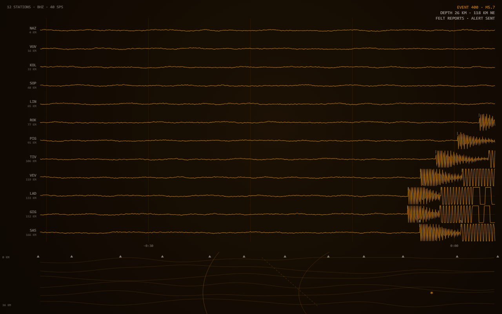 **Seismograph.** Station pens tremble until a quake's waves sweep down the stack. Big ones bring aftershock sequences. Quarry blasts, volcanic tremor, and great quakes from the far side of the planet that reach every station at once. | 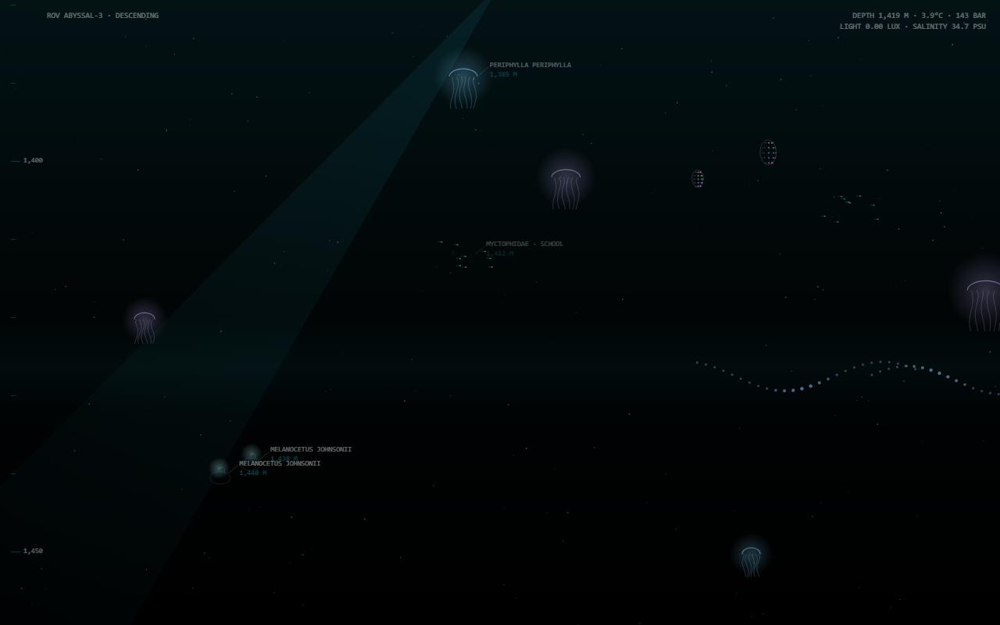 **Abyssal scanner.** Marine snow and bioluminescent animals. A startled jelly's alarm flash runs through its neighbors, and a dragonfish hunts by red light. Something very large crosses the edge of the light. |
| 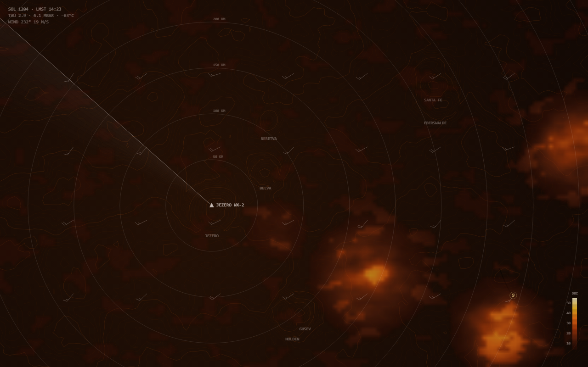 **Martian weather radar.** Dust storm cells drift over Jezero. A rover drives and cores samples, a helicopter scouts ahead, meteors leave fresh craters, and storm watches park everything. It all goes into the ops log. | 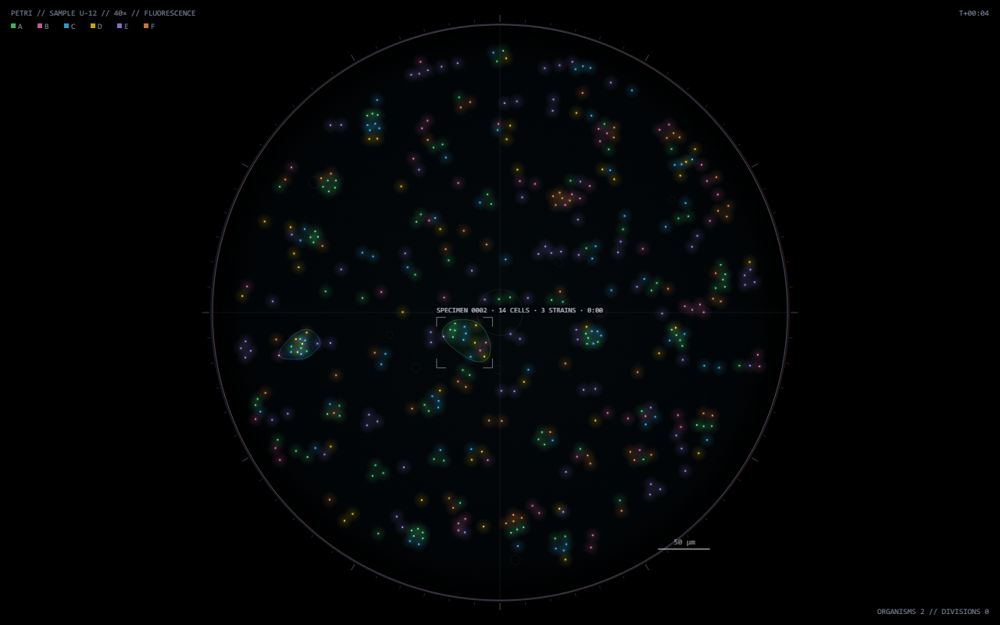 **Petri dish.** Artificial life under a fluorescence microscope. Particles of six strains pull on and push each other by a seeded rule, and from that alone, cells form with membranes, crawl, divide, and swallow each other. The instrument tracks specimens and logs it all. A technician adds nutrient drops, the medium shifts and a strain adapts, an antibiotic disk clears a zone, and very rarely something enormous drifts through. |

#### The Petri dish, up close

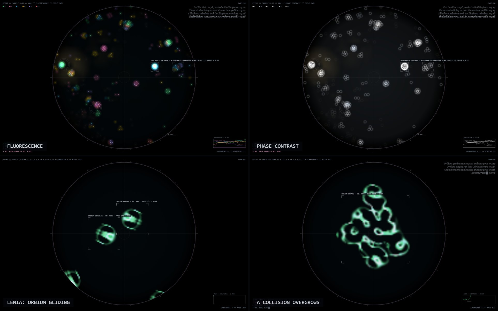

The life in the dish has to eat. The agar holds food that slowly regrows. Cells take it up and drift toward where there is more, and where it runs out they fade and die. The dead rot back into the agar, and spores come up where there is food again.

One strain hunts. The others flee it, and what it catches it eats, turning prey into more of itself when it is well fed. It also starves fastest, so its numbers boom and crash. Now and then something gets in at the rim, a contaminant that converts what it touches, until the technician puts it under the UV lamp.

The microscope behaves like one:
- The focus drifts as the stage warms, and the autofocus hunts back to sharp.
- The stage pans slowly to keep the action in the eyepiece.
- There are three stains: `fluorescent`, `darkfield`, and `phase` contrast, which shows dark bodies with bright halos.
- The lab notebook gives every organism a Latin name (a genus per strain, an epithet each, now and then one named for the sample) and notes what it saw, beside a chart of each strain's numbers over the last two minutes.

`medium: 'lenia'` swaps the particles for a Lenia culture, a continuous cellular automaton (Bert Chan's) run with FFT convolutions. Its creature is Orbium, a glider that looks alive. They swim out of the eyepiece and back in, and they meet: two may merge, break apart, dissolve, or set off an overgrowth that fills the field, which the technician dilutes before inoculating again.

### Basics

Not every site wants a story. Calm presets for product pages are built from the same layer library, tuned behind real text:

| calm-mesh | aurora-night | terminal-rain | fireflies |
| --- | --- | --- | --- |
|  | 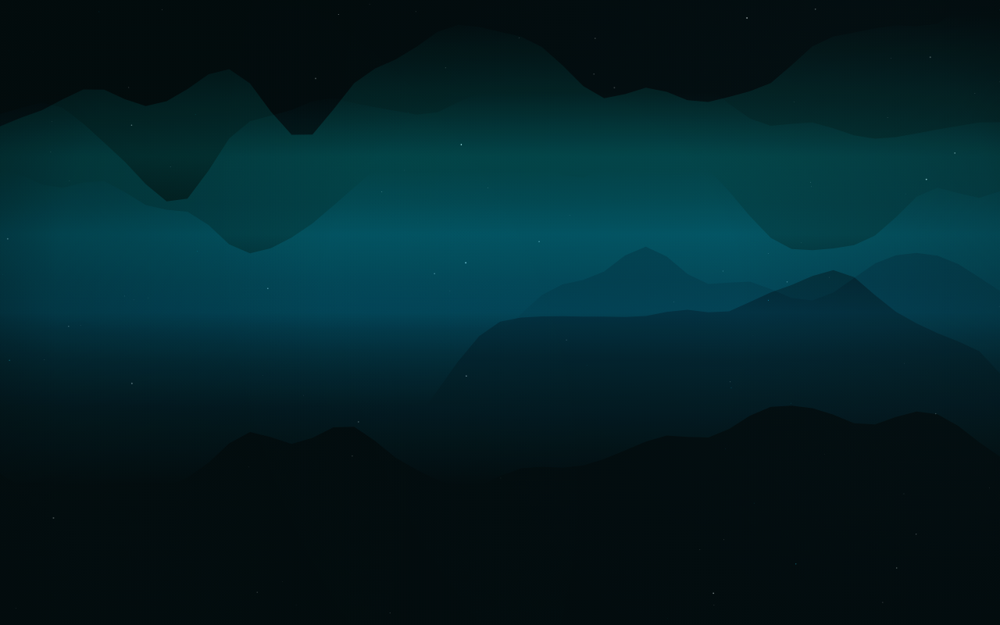 | 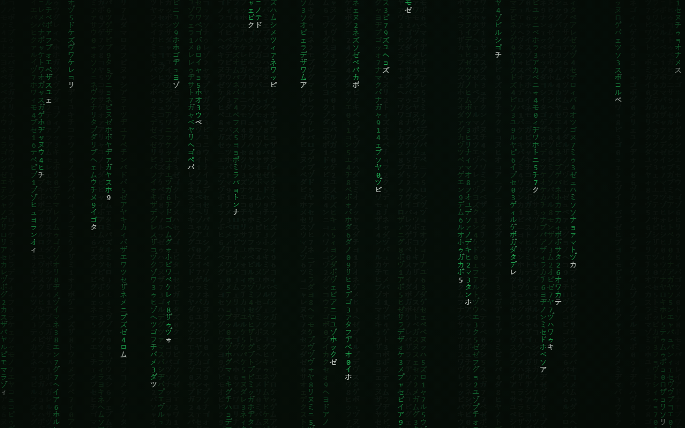 | 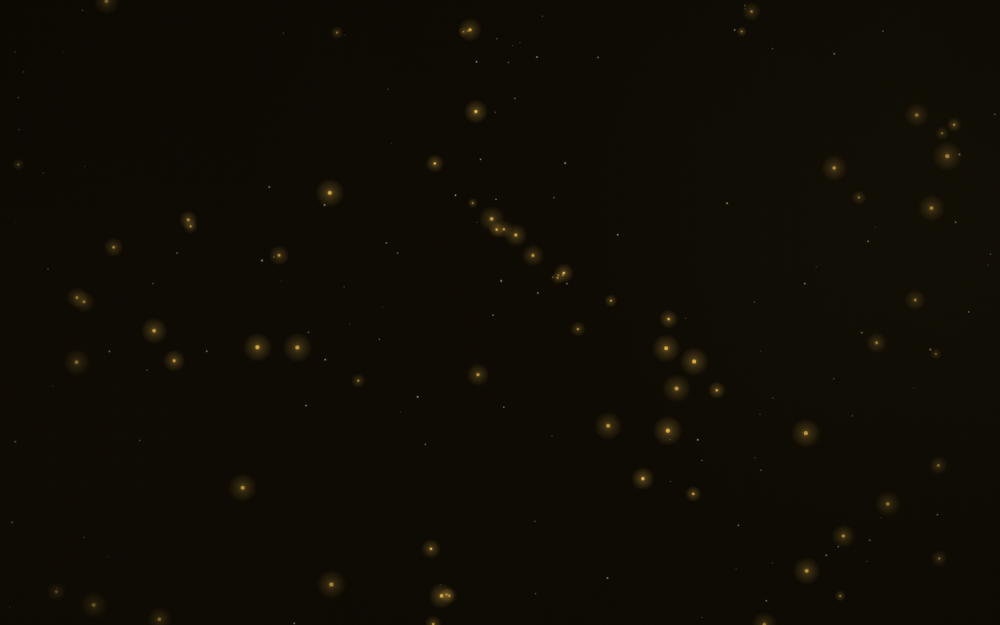 |
| **deep-field** | **flow-lines** | **paper-grid** | **nebula-drift** |
| 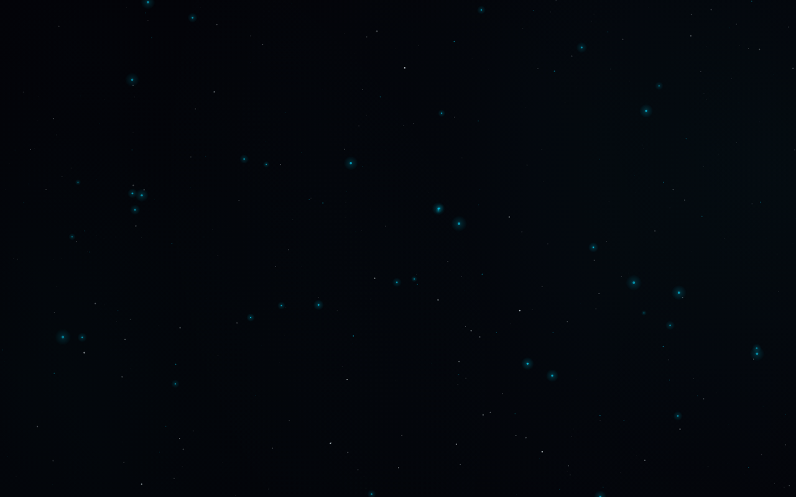 | 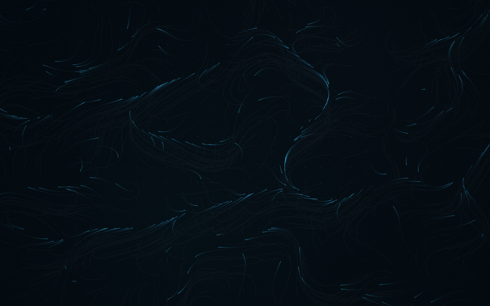 | 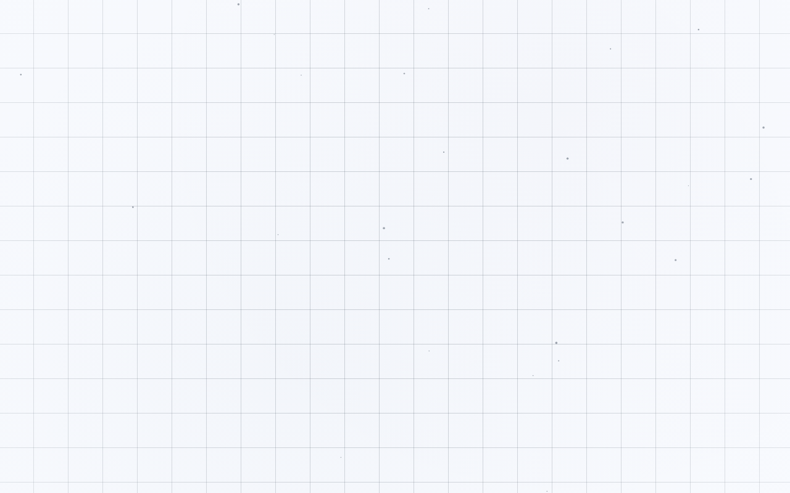 | 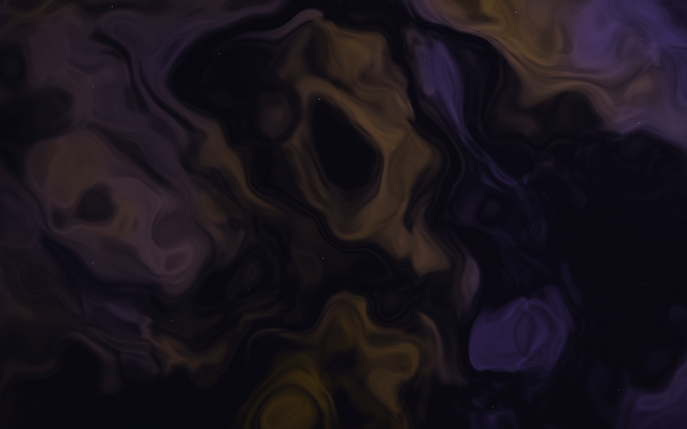 |

*Every image in this README was rendered by the engine at a fixed seed, so the same seed paints the same pixels on every run.*

## Make it your universe

You don't write a universe by hand:

1. In the studio, open **Universe → Make your own** and type a book, a film, a game, your tabletop setting, or a few lines about a world.
2. Click **Copy the prompt** and paste it into any AI.
3. Paste back what it writes, and the map becomes that world.

### What happens here

What makes a universe play differently is its *mechanics*: small plugins that spawn fleets, steer them, fight, break things, and draw on the map. A universe lists the ones it runs and how they're tuned. In the studio, under **What happens here**, you can switch any of them on or off and tune them. There are more than thirty built in. They include:
- the economy, raids, police, gates, and relays
- mining, wardens, and storms
- songs, leviathans, the Mouth, and echoes
- a front held cell by cell, spotted artillery, monitor duels, truces, and minefields
- the bloom, spores, and purges
- the ark, its flotilla, pursuers, and skimmers
- the lives of stars and of the civilizations around them

Writing a new one takes a few dozen lines:

```ts
import { registerMechanic, steerToward } from 'space-background-engine/skins/void-tactical';

registerMechanic({
  id: 'patrol',
  label: 'Patrols',
  description: 'Fighters warp in at one structure and sweep to another.',
  schema: { rate: { type: 'number', min: 0.1, max: 2, default: 0.5, label: 'Per minute' } },
  create(api, p) {
    let next = api.t + 5;
    return {
      update() {
        const [a, b] = api.structures();
        if (api.t < next || !a || !b) return;
        next = api.t + 60 / Number(p.rate);
        api.spawnFleet({ x: a.x, y: a.y, vx: 0, vy: 0 }, {
          cls: 'fighter',
          warpIn: true,
          steer: (f, dt) => {
            steerToward(f.ships[0], b.x, b.y, 110, 6, dt);
            if (Math.hypot(b.x - f.ships[0].x, b.y - f.ships[0].y) < 30) api.release(f);
          },
        });
      },
    };
  },
});

mount(document.body, { skin: 'void-tactical', options: { universe: 'saltwind', mechanics: [{ use: 'asteroids' }, { use: 'patrol' }] } });
```

`options.mechanics` replaces the universe's own list. Leave it out to keep that list. How the pieces fit (the camera, the event bus, shared services like the economy and the war state) is in [docs/ARCHITECTURE.md](docs/ARCHITECTURE.md).

## Sound

The worlds can be heard as well as seen. Sound is opt-in and generated, with no audio files, and adds about 6 KB:

```ts
import { createSoundscape } from 'space-background-engine/audio';

const sound = createSoundscape({ palette: 'choir' });
sound.attach(handle);
playButton.onclick = () => sound.start(); // browsers allow audio only after a click
```

Explosions boom where they happen across the screen. A raid brings a siren and a capture rings a bell. In the Choir, the songs are low voices answering each other, and in Undercity the thunder comes a moment late. Every world has its own palette and drone. In the studio, press the speaker (or **M**).

## Touching a world

In Wyrmspire, Deephold and Leylines a click nudges the world, and the nearest thing answers in its own way. A ring shows where you touched; the world says what happened in its own text.

- **Wyrmspire.** Click the spire and a stone wakes the wyrm (it may come down angry). Click a raiding wyrm and the bells turn it for home. The town rings for a feast, a village goes out for wood and builds, and the open land sends a caravan down the road.
- **Deephold.** Click the slopes and traders set out for the nearest hold. Click a hold's rooms and the bell rings for a feast. Click plain rock and a vein of iron, gold or gems shows itself; the miners will find it (one every half minute).
- **Leylines.** Click a tower and light runs down its lines. A village builds a cottage. Open land gathers an arcane storm, where this realm has storms.

The world waits a few seconds between nudges. Nudges are not part of the seed, so a replay of the same seed does not repeat them. On your own site, turn them on with `nudges: true`; on the wallpaper page, `&i=1` turns them on with zoom and pan.

## The journal

Things happen whether you are watching or not, so the studio keeps a journal. It keeps it quietly: nothing pops up over the world while it plays. The worlds tell their own story on the canvas, and the Journal tab gets a *new* mark when there is something to look at.

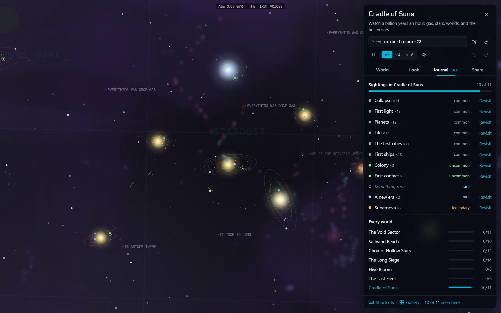

- **Sightings.** Every world has its own list of things that can happen in it, from common to legendary: a supernova in the Cradle, a gate surge in the Void, Mayday on the approach radar. The first time you see one, it is kept with its seed and the time. The everyday ones are named up front; the rare ones stay hidden until you have seen them.
- **Moments.** The first time something uncommon or rarer happens, the journal keeps a picture of it and a two-second clip. Press **K** to keep one yourself. Open a moment to see it large, download the picture (JPEG) or the clip (GIF), or copy its link. The link replays the seed from the start to just before the moment. A replay comes close to the picture, but not always frame for frame: worlds are made for their window size, and live frames are not fixed steps. The viewer says when your window differs from the one the moment was seen in.
- **This seed's history.** A ribbon along the world's time: every chronicled event as a tick (taller for rarer), moments as rings you can open.
- **The chronicle.** The uncommon and rarer events, written down as a line of history next to the map's own log line: *A ship fell behind.* `STRAGGLER · LANTERN 153 · ENGINE FAILURE`, then later *A tug went back for them, and brought them home.* `TUG 8 HAS THEM · LANTERN 153`. Copy it out as text.
- **While you were away.** Leave the tab and come back, and the world catches up on what it missed (up to five minutes), then shows you what happened in a card, with a picture of the world as it is now: *They found us, ship lost ×6, straggler ×3, rescue ×2.*

It all stays in your browser (localStorage; the pictures in IndexedDB, the last forty). Press **J** in the studio.

## As your wallpaper

Every world can run behind your desktop or on your phone. In the studio's **Share** tab:

- **Desktop, alive.** *Copy wallpaper link* gives a bare full-screen page at 30 fps that pauses when it is covered. On Windows, paste it into [Lively Wallpaper](https://www.rocksdanister.com/lively/) (free). On macOS, [Plash](https://sindresorhus.com/plash) (free). On KDE Plasma, a web wallpaper plugin.
- **Desktop, offline.** *Offline file* is one HTML file with the whole engine inside (about 450 KB). It needs no internet, now or ever. *Wallpaper Engine* packs the same file with a `project.json` and a preview: unzip it into `projects\myprojects`.
- **Desktop, still.** A PNG at your screen's full resolution.
- **Phone.** A still at 1170 × 2532, rendered at the phone's own pixel density so the small text stays sharp. Or a 10 second portrait video (MP4 where the browser can record it) for a video wallpaper app. Or open the wallpaper link on the phone and add it to the home screen: it opens full screen and alive, and remembers its world.

Step-by-step guides for each app (Lively, Wallpaper Engine, Plash, KDE, Android, iPhone), with settings that save battery: [docs/WALLPAPERS.md](docs/WALLPAPERS.md).

The wallpaper page reads the same configuration as `mount()`, base64url-encoded in `?c=`, plus `fps`, `pr` (pixel ratio), `skip` (seconds to simulate first, so the world starts busy), and `i=1` (wheel zoom and drag pan).

## Put one on your site

The quickest way: open the [studio](https://aesthetic-backgrounds-library.vercel.app), pick one, and click **Copy prompt for your AI**. Paste it into Claude, ChatGPT, Cursor, or v0. The prompt carries the exact configuration and the few rules that keep it right.

Or drop it in yourself.

**As a web component:**

```html
<script type="module" src="https://unpkg.com/space-background-engine/dist/element.js"></script>
<vivarium-bg skin="void-tactical" seed="orion-7"></vivarium-bg>
```

The element has two names: `<vivarium-bg>`, and `<bg-engine>` from before the project had one. They are the same element and take the same attributes.

Pick a skin, derive a palette from your brand color, and dial the presence down:

```html
<bg-engine skin="matrix-rain" palette="#ff7a1a" intensity="0.6"></bg-engine>
```

**From JavaScript:**

```ts
import { mount } from 'space-background-engine';

// Full-page background behind everything
mount(document.body, { skin: 'void-tactical', seed: 'orion-7', options: { universe: 'saltwind' } });

// Or inside a positioned container
mount('#hero', { skin: 'undercity', intensity: 0.6 });
```

`mount()` returns a handle with `canvas`, `root`, `pause()`, `resume()`, `renderOnce()`, `onEvent()`, and `destroy()`. Page content stays fully clickable, because the whole background stack has `pointer-events: none`.

---

# Reference

Everything about the API, the configuration, and how to extend it. How the internals fit together is in [docs/ARCHITECTURE.md](docs/ARCHITECTURE.md).

> **Status:** early. The API below is stable enough to try, but not yet stable enough to depend on. Plans and open items are in [docs/ROADMAP.md](docs/ROADMAP.md).

## Installation

```bash
pnpm add space-background-engine
```

The bare import (`space-background-engine`) is batteries included: the core, every built-in skin, the standard layer library, and the curated presets. For a smaller bundle, import only what you use. `core` has no skins, and each skin registers itself when it is imported:

```ts
import { mount } from 'space-background-engine/core';
import 'space-background-engine/skins/matrix-rain';

mount('#hero', { skin: 'matrix-rain' });
```

| Entry | What it adds |
| --- | --- |
| `space-background-engine` | The core, every skin, the layers and presets, and the shader, manifest, and token tools. |
| `/core` | The host: mount, sizing, clock, palettes, registries. |
| `/skins/void-tactical` | The sector map, its universes (loaded on demand), and the mechanics API. |
| `/skins/undercity` | Undercity's shell. The city itself loads on first mount. |
| `/skins/fantasy` | Shieldwall, Ages, the War Table, Wyrmspire, Deephold, and Leylines: shells; each world loads on first mount. |
| `/skins/petri` | The Petri dish's shell; the dish loads on first mount. |
| `/skins/drifting-dust`, `/skins/matrix-rain` | The small skins. |
| `/layers`, `/presets` | The layer library and the curated presets. |
| `/shader` | `createShaderLayer` for GPU layers. |
| `/manifest`, `/tokens` | Preset manifests (JSON) and design-token import and export. |
| `/audio` | Generated sound bound to events. |
| `/react`, `/vue`, `/svelte`, `/element` | Framework adapters and the `<bg-engine>` element. |

## Presets

Presets are the fastest path to a good result. Each is a tuned scene with its own palette and intensity defaults, registered like a skin:

```ts
import { mount } from 'space-background-engine/core';
import 'space-background-engine/presets';

mount(document.body, { skin: 'calm-mesh' });                       // light SaaS plate
mount('#hero', { skin: 'aurora-night', palette: '#22d3ee' });     // override the palette
```

| Preset | Niche | Theme |
| --- | --- | --- |
| `calm-mesh` | SaaS landing, marketing | light |
| `aurora-night` | SaaS, events | dark |
| `terminal-rain` | developer portfolios | dark |
| `deep-field` | space, sci-fi (no HUD) | dark |
| `flow-lines` | data, science, analytics | dark |
| `fireflies` | nature, wellness, quiet portfolios | dark |
| `nebula-drift` | space, music, events | dark |
| `ink-wash` | editorial, studios, portfolios | light |
| `paper-grid` | editorial, brutalist | light |
| `void-sector` | space, sci-fi, dense | dark |

## Frameworks

**React:**

```tsx
import { Background } from 'space-background-engine/react';

export function App() {
  return (
    <>
      <Background skin="void-tactical" seed="orion-7" options={{ universe: 'siege' }} />
      <main>{/* your site content goes here */}</main>
    </>
  );
}
```

`Background` wraps `mount()`. Any prop change tears the background down and mounts it again with the new settings. The built React entry is marked `'use client'`, so it works as-is in the Next.js App Router.

**Vue, Svelte, Astro, no build step.** Each adapter is a thin layer over `mount()`, with no framework dependency of its own:

```ts
// Vue 3: a directive
import { BackgroundPlugin } from 'space-background-engine/vue';
app.use(BackgroundPlugin);           // <section v-background="{ skin: 'calm-mesh' }" />

// Svelte: an action
import { background } from 'space-background-engine/svelte';   // <div use:background={{ skin: 'deep-field' }} />
```

Astro and plain HTML use the `<bg-engine>` element. Without a bundler, an import map pins a version from a CDN. See [examples/importmap.html](examples/importmap.html).

## Copy a background into your project

The CLI reads the registry and writes one editable file. The scene then lives in your repo, where you and your agent can change it, while the engine stays a dependency:

```bash
npx space-background-engine list --kind preset
npx space-background-engine info aurora-night
npx space-background-engine add aurora-night --palette '#ff7a1a' --intensity 0.6
npx space-background-engine add calm-mesh --tokens ./design/tokens.json
```

`add` writes `src/backgrounds/<id>.ts` with the manifest inlined and a `mountBackground()` function. `--tokens` derives the palette from a brand token file.

## Community presets

A preset is data: a scene plus config defaults. Anyone can publish one as JSON without shipping code, because every layer validates its options against a schema before anything mounts.

```ts
import { mount } from 'space-background-engine';
import { loadPresetManifest } from 'space-background-engine/manifest';

const preset = await loadPresetManifest('https://example.com/ember-nocturne.json');
mount(document.body, { skin: preset });
```

`validatePresetManifest()` reports every problem with a path (`scene.layers[1].with.style: "hexagons" is not one of dots, lines, cross`). Point `"$schema"` at `registry/preset.schema.json`, and editors autocomplete layer ids and every option with its range. To list a preset in the gallery, add its JSON to [registry/community](registry/community) in a pull request. CI validates it, and it appears in the studio with no code change. In the studio, `?preset=<url>` loads and selects any manifest.

## Palette tokens on your page

Pass `exposeTokens: true`, and the background's palette is written as `--bge-*` variables on `<html>`, so your own UI can follow it. With Tailwind:

```css
/* Tailwind v4 */
@import "tailwindcss";
@import "space-background-engine/tailwind.css";   /* bg-bge-bg, text-bge-ink, border-bge-accent, ... */
```

```js
// Tailwind v3
import bge from 'space-background-engine/tailwind-preset';
export default { presets: [bge] };                  // supports opacity: bg-bge-accent/20
```

To share the palette with design tools, use `space-background-engine/tokens`. `paletteToTokens()` exports W3C DTCG tokens that Figma Variables importers and Tokens Studio read, and `paletteFromTokens()` derives a palette from an existing token file. Both are buttons in the studio.

## Configuration

| Option | Default | Description |
| --- | --- | --- |
| `seed` | random | PRNG seed. The same seed replays the same world, frame for frame. |
| `skin` | `'void-tactical'` | A skin object or a registered id. Skins: `void-tactical`, `undercity`, `shieldwall`, `ages`, `war-table`, `wyrmspire`, `deephold`, `leylines`, `sonar`, `atc-radar`, `seismograph`, `abyssal`, `mars-radar`, `petri`, `drifting-dust`, `matrix-rain`, and every preset id. |
| `options` | `{}` | Skin-specific options; see each skin's section below. |
| `palette` | `'void-cyan'` | One of: <ul><li>a built-in id (`void-cyan`, `amber`, `violet`)</li><li>a full token object</li><li>a bare hex color</li><li>`{ from: '#hex', theme: 'dark' \| 'light', harmony }`, which derives a palette in OKLCH. `harmony` (`analogous`, `complementary`, `split`, `triadic`, `mono`) sets the secondary hues `accent2` and `accent3`.</li></ul> |
| `exposeTokens` | `false` | Also write the palette as `--bge-*` variables on `<html>` (or a given element) for your own UI. |
| `intensity` | `1` | How much the background asserts itself, `0` to `1`. Skins scale motion, density, and contrast by it. |
| `motion` | `'auto'` | `auto` honors `prefers-reduced-motion`. `full`, `reduced`, or `off` force a mode, and `off` renders a single frame. |
| `density` | `1` | Population multiplier for generated entities (clamped 0.25–2). |
| `light` | seeded | `{ angle, warmth }`: one key light that every layer reads. Omit `angle` and the seed picks an upper corner. `warmth` runs from cool (`-1`) to warm (`1`). |
| `legibility` | `'auto'` | Measures the page's content boxes (`main, article, [data-bg-content]`) and makes the background recede behind them, adding a feathered shade above `intensity` 0.55. Use `'off'`, or `{ selector, strength }` for a fixed shade. |
| `quiet` | `[]` | Extra quiet zones as viewport fractions `{ x, y, width, height }`, for content the selector cannot see. |
| `detail` | `'low'` | Label and HUD budget for the sector map (`none`, `low`, `medium`, `high`). |
| `cameraSpeed` | `0.25` | Base drift speed, in world units per frame at 60 fps. Real speed is time-based. |
| `interactive` | `false` | Wheel zoom and drag pan on empty parts of the page, for skins with a camera. |
| `nudges` | `false` | A click on an empty part of the page nudges the world there (Wyrmspire, Deephold, Leylines): a ring shows where, and the world answers. Also `handle.nudge(x, y)`. |
| `targetFps` | `60` | Frame cap for the render loop. Lowering it does not slow the animation. |
| `pixelRatio` | device | Backing pixels per CSS pixel, fixed. By default the device's, capped at 1.5 (2 for text-heavy skins) and lowered by the quality governor. Set it for exports and wallpapers: `3` renders a phone-sized viewport at a phone's own resolution. |
| `adaptiveQuality` | `true` | Lowers `host.quality` when frames run over budget, and raises it back when they recover. |
| `zIndex` | `0` | z-index of the background root. |
| `fonts` | `false` | Loads the display fonts used by built-in canvas text (Orbit, Syne Mono) from Google Fonts. Off by default, so the package makes no network requests. |

`<bg-engine>` attributes: `seed`, `skin`, `palette`, `intensity`, `motion`, `density`, `detail`, `speed`, `fps`, `fonts`, `z-index`, `light-angle`, `warmth`, `legibility` (`auto` or `off`).

## What the engine guarantees

- **Deterministic replay.** `Math.random`, `Date.now`, and timers are banned from skins. The host hands each frame seeded random streams and a clock. Two instances with the same seed issue identical draw calls, which the test suite checks for every built-in skin, and the browser gates check for pixel-identical PNGs.
- **Time-based motion.** Skins receive `dt` in seconds (clamped after stalls), so animation speed doesn't depend on frame rate or on `targetFps`.
- **Motion policy.** `prefers-reduced-motion` is honored by default: skins see `motion: 'reduced'` and a halved `intensity`. `off` renders one static frame and stops the loop.
- **Pauses when unseen.** The loop stops while the tab is hidden or the canvas is scrolled offscreen, and resumes without a time jump.
- **Container-aware sizing.** The canvas fills whatever it is mounted in and follows it through a `ResizeObserver`, with a window fallback. The backing store is scaled by `devicePixelRatio`, capped at 1.5x.
- **Scoped styling.** Palette tokens are written as `--bge-*` custom properties on the engine root only, never on your `:root`.
- **DOM isolation and clean teardown.** Everything lives in a `.bg-engine-root` with `pointer-events: none`. `destroy()` removes the DOM, disconnects observers and listeners, cancels the loop, and is safe to call twice.
- **Text stays readable.** By default the host finds your content boxes, and motion layers thin out behind them. Busy scenes also get a feathered shade. Every built-in skin and preset holds a mean 7:1 contrast behind a text column in the browser gates.
- **Zero dependencies, small by default.** The host is about 16 KB gzipped. Universes beyond the first, mechanics, the Undercity city, and sound all load only when used. Budgets are enforced in CI.

## Scenes and layers

Under the presets sits a composable model:
- A **layer** is one effect, with a declared option schema.
- A **scene** is JSON: an ordered stack of layer references, bottom to top, each with options, opacity, and a blend mode.

The `scene` skin runs any scene. A background can be authored, tuned in the studio, and pasted into `mount()` with no code:

```ts
import { mount } from 'space-background-engine/core';
import 'space-background-engine/layers';

mount(document.body, {
  skin: 'scene',
  palette: { from: '#ff7a1a' },
  intensity: 0.7,
  options: {
    layers: [
      { use: 'gradient-base', with: { tint: 0.3 } },
      { use: 'starfield', with: { density: 0.8, bands: 3 } },
      { use: 'aurora', with: { bands: 2 }, blend: 'lighter', opacity: 0.8 },
      { use: 'vignette' },
      { use: 'grain', with: { opacity: 0.08 } },
    ],
  },
});
```

Standard layers:
- **Bases and fields:** `gradient-base`, `mesh-gradient`, `aurora`, `starfield`, `grid`
- **Motion:** `particles-drift`, `plexus`, `flow-field`, `glyph-rain`
- **Light and finish:** `light-follow`, `vignette`, `grain`, `scanlines`
- **Legibility:** `content-shade`, a feathered shade behind your text column, so any scene passes a contrast check
- **Events:** `moments`, rare seeded events (see below)

Any whole skin can also be used as a layer (`fromSkin`), and the sector map registers itself that way. Every layer:
- reads its colors from the palette, or from tokens like `accent` and `inkDim`
- scales itself by `intensity` and `quality`
- draws deterministically from the seeded streams

Options are validated against each layer's schema: numbers are clamped, unknown enum values fall back to defaults, and nothing throws on a typo in a JSON preset. The same schema drives the studio's controls, and it is what an agent fills in when it builds a scene for you.

**Shader layers.** Layers can render on the GPU. `createShaderLayer` takes a GLSL ES 3.00 fragment shader and gives it a private WebGL2 surface, composited like any other layer. Uniforms come from:
- the frame: `u_time`, `u_dt`
- the host: `u_resolution`, `u_pointer`, `u_intensity`, `u_quality`, `u_seed`
- the palette: `u_bg`, `u_accent`, `u_accent2`, `u_accent3`, `u_ink`, `u_hazard`
- the scene light: `u_lightDir`, `u_lightPos`, `u_warmth`
- your schema: every numeric, boolean, and color field, as `u_<name>`

A prelude provides `hash21`, `vnoise`, and `fbm`.

```ts
import { createShaderLayer } from 'space-background-engine/shader';
import { registerLayer } from 'space-background-engine/core';

registerLayer(createShaderLayer({
  id: 'haze', label: 'Haze', schema: { scale: { type: 'number', min: 1, max: 6, default: 3 } },
  fragment: `void main() {
    float n = fbm(v_uv * u_scale + u_time * 0.05, 4);
    float a = smoothstep(0.0, 0.8, n) * 0.4 * u_intensity;
    fragColor = vec4(u_accent * a, a);
  }`,
}));
```

Because every input is a uniform, shader layers stay deterministic: the same seed renders identical pixels. The built-in shader layers are `nebula` and `ink-flow`. Where WebGL2 is unavailable, the layer logs once and is skipped, and the rest of the scene renders normally. If the GPU drops the context, the layer pauses and rebuilds its program when the context is restored. Heavy layers can set `rate: 0.5` to render every other frame.

To publish your own preset, wrap a scene:

```ts
import { registerPreset } from 'space-background-engine/core';

registerPreset({
  id: 'ember-field',
  label: 'Ember field',
  tags: ['dark', 'warm'],
  config: { palette: { from: '#f97316' }, intensity: 0.8 },
  scene: { layers: [{ use: 'gradient-base' }, { use: 'particles-drift', with: { glow: 0.9 } }] },
});
```

## Light, quiet zones, moments, transitions

Layers in a scene agree with each other because the host gives them a shared composition.

- **One key light.** `host.light` holds an angle, a unit direction, an in-frame key position, and a warmth. By default the seed places the light in an upper corner, never top center. Set `light: { angle: 225, warmth: 0.4 }` to pin it. Layers use it like this:
  - `gradient-base` puts its main glow at the key and a fill light opposite.
  - `vignette` opens toward the light.
  - The `nebula` shader lights the side of each cloud that faces the key.
  - `moments` aims comet tails and flare spikes by it.
  - Shader layers receive `u_lightDir`, `u_lightPos`, and `u_warmth`.
- **Quiet zones.** With `legibility: 'auto'`, the host measures your content boxes on mount, resize, and scroll. `host.quiet(x, y)` returns 0 to 1 near those boxes, with a soft falloff. Particles, stars, plexus links, glyph-rain heads, and flow lines recede there (each layer's `quiet` option sets how much), so text sits on calm ground instead of under a shade box. At high `intensity`, a feathered shade is added too.
- **Moments.** The `moments` layer stages rare, seeded events: a meteor every minute or so, a slow comet, a star that flares. Gaps are random and long, and events avoid your text. The same seed stages the same events at the same seconds. Under reduced motion, only flares remain.
- **Transitions.** `transition(handle, nextOptions, { kind, duration })` mounts the next scene in place and reveals it with one of:
  - `crossfade`
  - `wipe`, from the lit side
  - `iris`, opening from the new scene's key light

  It is driven by the incoming scene's own clock, so it replays deterministically. It is instant with motion off, and a crossfade under reduced motion. In React, pass `transition` to `<Background>`.

```ts
import { mount, transition } from 'space-background-engine';

let bg = mount(document.body, { skin: 'deep-field', light: { warmth: -0.2 } });
// later, when the page changes section:
bg = transition(bg, { skin: 'aurora-night' }, { kind: 'iris', duration: 1.4 }).handle;
```

`handle.composition()` reports the light, the measured content rects, the quiet zones, and the current shade strength, and `handle.onFrame(fn)` subscribes to frames. The studio's **Show composition** overlay draws all of it over the live background.

## Events and sound

`handle.onEvent(fn)` reports what happens in a background as it happens. Each `SkinEvent` carries:
- `type`: `explosion`, `raid`, `capture`, `song`, `bombard`, `breach`, `supernova`, ...
- `weight`: 0 to 1, how much it matters
- `pan`: -1 to 1, where across the screen it happened
- `near`: 1 when it is on screen and up front

The sector map, Undercity, and the five instruments report what happens: torpedoes, quakes, emergencies, storms, and more. Skins also send `ambience` (0 to 1: the sector's tension, how hard it is raining), which sound uses for its beds. Events are silent during `fastForward` and cost nothing while nobody listens. At a time scale above 1, every step reports, since that is live time running faster.

Sound is a separate, opt-in entry. Every sound is synthesized, so there are no assets to load:

```ts
import { mount } from 'space-background-engine';
import { createSoundscape } from 'space-background-engine/audio';

const bg = mount(document.body, { skin: 'void-tactical', options: { universe: 'siege' } });
const sound = createSoundscape({ palette: 'siege', volume: 0.5 });
sound.attach(bg);
button.onclick = () => sound.start(); // browsers allow audio only after a click or key press
```

A **sound palette** maps event types to cues (boom, ping, bell, sweep, whoosh, thump, choir, crackle). It also sets a drone and a noise bed underneath: rain in Undercity, wind on Saltwind, the hull's hum in the Last Fleet, the deep in Sonar. There is one per world and instrument:
- worlds: `void`, `saltwind`, `choir`, `siege`, `hive`, `lastfleet`, `cradle`, `undercity`
- instruments: `sonar`, `atc-radar`, `seismograph`, `abyssal`, `mars-radar`

`registerSoundPalette()` adds your own.

Under the hood, everything runs through a mastering chain: rumble cut, soft saturation, glue compression, and a limiter. It plays in a generated stereo room with early reflections and a damped tail, and echoes go through a ping-pong delay.
- **Distance.** A cue's loudness follows the event's weight and nearness, and far events are darker and deeper in the room.
- **Space for big hits.** Big hits briefly duck the bed.
- **Timing.** Notes land on a quiet pulse, so a busy map sounds composed rather than random.
- **Restraint.** A per-cue rate limit keeps a busy map from turning to noise, and the soundscape suspends while the tab is hidden.

`pnpm sound-check` renders every palette offline and reports its levels.

## The sector map's options

`skin: 'void-tactical'`. Every authored color is pulled into the active palette family, so it works with `palette: '#ff7a1a'` as well as with the built-ins.

| Option | Default | Effect |
| --- | --- | --- |
| `universe` | `'void'` | `void`, `saltwind`, `choir`, `siege`, `hive`, `lastfleet`, `cradle`, or your own (`registerUniverse`). Universes beyond the first load on demand. |
| `pack` | none | An inline universe pack, for example one an AI wrote with `universePrompt()`. Wins over `universe`. |
| `mechanics` | the universe's | `[{ use, with, enabled }]` replaces the universe's mechanics list. |
| `camera` | `'director'` | `steady` (fixed framing), `director` (now and then it leans in on something happening), or `cinematic` (it chases the action). |
| `lean` | `true` | The camera drifts a few percent toward the pointer. |
| `scroll` | `false` | Scrolling down the page carries the map forward through the sector. |
| `hueVariety` | `0.94` | `0` pulls every entity into the palette family, and `1` keeps the original rainbow. |
| `lineWeight` | `1.4` | Multiplier on all strokes. |
| `spriteScale` | `0.8` | Size of the ASCII structure art. |
| `shipScale` | `1` | Size of the ships. |
| `hud` | `0.6` | Opacity of labels, telemetry, and chatter. |
| `paths` | `'dashed'` | Planned courses: `dashed`, `dots`, or `off`. |
| `trails` | `0.9` | Fleet trail opacity. |
| `lock` | `true` | Target lock: brackets close on a contact every half minute. |
| `gradient`, `mesh`, `asciiGrid`, `ascii1`, `ascii2`, `clouds`, `noise`, `mouseGlow`, `starfield` | all on except `starfield` | Toggles for each CSS atmosphere layer. |

The skin's own config defaults are `intensity: 0.45`, `density: 1.5`, `detail: 'high'`, and `palette: 'void-cyan'`: a dense, fully annotated sector, held back to 45% presence so page content leads. Pass any of them to `mount()` to override.

A universe pack is JSON. Its fields are:
- names, factions, ships, structures and their ASCII art, anomalies, and chatter
- its mechanics
- a `look`:
  - `lanes`, `grid`, `traffic`, and `anomalies`
  - `depth`, the share of scenery on far planes
  - `scenery` (`0` leaves space empty for the mechanics to fill)
  - `drift`, how fast the map travels
  - `ground`, the terrain under the map
- an `economy`

`universePrompt(subject)` writes the prompt that asks an AI for one, and `validateUniverse()` fixes up what comes back.

The same simulation is also available as **layers** that share one world per mount: `void-atmosphere` (the CSS plate), `void-stars`, `void-systems`, `void-fleets`, and `void-hud`. The `void-sector` preset is the skin rebuilt from them. So in a scene you can drop the HUD, dim the fleets to half opacity, or slide `grain` and a `content-shade` between the systems and your text, and the fleets still steer toward the structures the systems layer draws:

```ts
mount(document.body, {
  skin: 'scene',
  intensity: 0.45,
  density: 1.5,
  detail: 'high',
  options: {
    layers: [
      { use: 'void-atmosphere' },
      { use: 'void-stars' },
      { use: 'void-systems', with: { spriteScale: 1.2 } },
      { use: 'void-fleets', with: { paths: 'off' }, opacity: 0.6 },
      { use: 'content-shade', with: { strength: 0.5 } },
    ],
  },
});
```

## Undercity's options

`skin: 'undercity'`. The city is a lazy chunk (about 14 KB gzipped) that loads the first time it mounts. Call `prepareUndercity()` to load it ahead of time.

| Option | Default | Effect |
| --- | --- | --- |
| `speed` | `1` | How fast the city drifts past (`0` holds still). |
| `rain` | `0.8` | Rain, from none to a downpour (`0` to `1.5`). Heavy rain brings lightning. |
| `traffic` | `1` | Air traffic in the lanes between the layers. |
| `crowd` | `1` | Pedestrians on the street. |
| `net` | `1.2` | Netruns per minute. |
| `overlay` | `true` | Show the net's wireframe and packets. |
| `hud` | `true` | The terminal readout: district, rain, net load, and the run log. |

## Shieldwall's options

`skin: 'shieldwall'`. The battles are a lazy chunk (about 28 KB gzipped) that loads the first time one mounts; `getSkin('shieldwall').prepare()` loads it ahead.

| Option | Default | Effect |
| --- | --- | --- |
| `view` | `'side'` | `side`: the field under a sky. `above`: the field as a map at dusk. |
| `battles` | `'any'` | `any` (about three in ten are sieges), only `field` battles, or only `siege`s. |
| `troops` | `1` | Army size (`0.3` to `2`), about 150 a side at `1`. Scaled by `density` too. |
| `magic` | `1` | How often mages cast (`0` for none). |
| `dragons` | `1` | How likely a dragon is in a battle: about one in four at `1`. |
| `weather` | `'any'` | `any` (the seed picks per battle), `clear`, `rain`, `snow`, `fog`, or `night`. |
| `camera` | `'follow'` | `follow` the fighting, or hold `still` over the middle of the field. |
| `labels` | `true` | Call-outs on the field: charges, volleys, a lord falling. |
| `hud` | `true` | The field's name, the war's score, and its chronicle. |

## Ages' options

`skin: 'ages'`. A lazy chunk, like Shieldwall's.

| Option | Default | Effect |
| --- | --- | --- |
| `speed` | `1` | The pace of history: 2.5 years a second at `1`. |
| `kingdoms` | `5` | Peoples at the start (2 to 8). |
| `wars` | `1` | How quickly borders turn to war (`0` for none). |
| `disasters` | `1` | How often plague, fire, hordes, and civil wars come. |
| `dragons` | `1` | How likely a dragon is when trouble comes. |
| `labels` | `true` | Call-outs on the map. |
| `hud` | `true` | The year and era, the peoples by the towns they hold, and the chronicle. |

## The Petri dish's options

`skin: 'petri'`. A lazy chunk (about 18 KB gzipped, both media).

| Option | Default | Effect |
| --- | --- | --- |
| `medium` | `'particles'` | `particles` (strains of particle life) or `lenia` (a Lenia culture of Orbium). |
| `stain` | `'fluorescent'` | `fluorescent` (a dye per strain), `darkfield` (silver on black), or `phase` (phase contrast: dark bodies, bright halos). |
| `species` | `6` | How many strains (3 to 7). |
| `life` | `1` | How many particles, relative to the dish's size. |
| `predators` | `true` | One strain hunts the others (its numbers boom and crash). |
| `drops` | `1` | The technician: how often nutrient drops, antibiotic disks, inoculations, and contaminations come (`0` for never). |
| `tracking` | `true` | Brackets and a readout (with a Latin name) on a few specimens. |
| `notebook` | `true` | The lab notebook and the population chart. |
| `hud` | `true` | The instrument readout (with the focus), the strains' dyes, the scale bar, and the log. |

## The War Table's options

`skin: 'war-table'`. A lazy chunk, like the other fantasy worlds. Its default palette is light (dark ink), for pages with dark text.

| Option | Default | Effect |
| --- | --- | --- |
| `realms` | `2` | Realms at war: `2` or `3`. |
| `pace` | `1` | The pace of the campaign: a month every 3.2 seconds at `1`. |
| `dragons` | `1` | How likely a dragon is in a month. |
| `candle` | `true` | Candlelight from one side. |
| `notes` | `true` | Notes in the margin: battles, sieges, falls, the peace. |
| `fog` | `true` | The fog of war: the map as one realm's council knows it, the rest in pencil. `false` shows everything in ink. |

## Wyrmspire's options

`skin: 'wyrmspire'`. A lazy chunk, like the other fantasy worlds (both styles ship in it).

| Option | Default | Effect |
| --- | --- | --- |
| `style` | `'vale'` | `vale` (the living valley) or `classic` (the first version). |
| `camera` | `'drift'` | `drift`: the whole world on screen, easing in slowly for the biggest moments only. `still`: the whole world, never moving. `director`: the old wider world, followed shot by shot. |
| `valley` | `'any'` | The land: `alpine`, `fjord`, `canyon`, `fen`, `ashland`, or `any` (one per seed). Its houses, water, weather, and breed of wyrm. |
| `wrath` | `1` | How restless the wyrm grows (`0` for never: a quiet valley, though thieves may still wake it). |
| `knights` | `1` | How many ride out (`0` for none: the villages are on their own). |
| `villages` | `3` | Villages besides the town (about; the seed varies it): `2` to `4`. |
| `time` | `'cycle'` | `cycle` (dawn, day, dusk, night), or always `dusk` or `night`. |
| `labels` | `true` | Call-outs: raids, hunts, new buildings, tournaments, quests, policies, festivals. |
| `hud` | `true` | The valley, the wyrm's state and hoard, the lord's policy, the settlements and their roofs, the chronicle. |

## Deephold's options

`skin: 'deephold'`. A lazy chunk (about 88 KB gzipped, both styles), like the other fantasy worlds.

| Option | Default | Effect |
| --- | --- | --- |
| `style` | `'kingdom'` | `kingdom` (a range of rival holds) or `classic` (the single hold). |
| `camera` | `'drift'` | `drift`: the whole world on screen, easing in slowly for the biggest moments only. `still`: the whole world, never moving. `director`: the old wider world, followed shot by shot. |
| `holds` | `'any'` | How many holds in the range: `2`, `3`, `4`, or `any` (drawn per seed). |
| `mountain` | `'any'` | `iron`, `crystal`, `frost`, `ember`, `drowned`, or `any` (one per seed): its rock, ores, hazards, and what sleeps below. |
| `depth` | `1` | Classic only: how greedily they dig (`0.3` to `2`). |
| `hazards` | `1` | How hard the mountain is: hazards and hostile neighbors in the cast (`0` for none). |
| `below` | `'any'` | What lies below: `sleeper`, `lich`, `engine`, `hive`, `nothing`, or `any` (drawn per seed). |
| `scale` | `1` | How big the range and the clans (`0.5` to `2`). |
| `labels` | `true` | Call-outs: strikes, rooms, highways, wars, the dragon, floods, cave-ins, the deep. |
| `hud` | `true` | The holds, their kings and wars, what the mountains hold, the artifacts, the chronicle. |

## Leylines' options

`skin: 'leylines'`. A lazy chunk, like the other fantasy worlds.

| Option | Default | Effect |
| --- | --- | --- |
| `style` | `'realm'` | `realm` (towers, mages and spells on a drawn land), `ink` (growing lines), or `classic` (the first version). |
| `camera` | `'drift'` | `drift`: the whole world on screen, easing in slowly for the biggest moments only. `still`: the whole world, never moving. `director`: the old wider world, followed shot by shot. |
| `land` | `'any'` | `isles`, `steppe`, `forest`, `desert`, `tundra`, `marsh`, `mountains`, or `any` (a blend drawn per seed). |
| `scale` | `1` | How big the land and how much is going on (`0.5` to `2`). |
| `orders` | `4` | Orders of mages at the start (about; the seed varies it): `2` to `6`. |
| `storms` | `1` | Weather in the cast (`0` for none). |
| `rifts` | `1` | Calamities in the cast (`0` for none). |
| `labels` | `true` | Title cards for the big moments. |
| `hud` | `true` | The land, the orders (school, archmage, towers, mages, wars), the cast, artifacts, a short chronicle. |

## Silent Running's options

`skin: 'silent-running'`. A lazy chunk, built on the world kit.

| Option | Default | Effect |
| --- | --- | --- |
| `camera` | `'drift'` | `drift`: the whole chart, easing in slowly for the biggest moments only. `still`: never moving. `director`: following each moment. |
| `traffic` | `1` | How busy the lanes are (`0.4` to `2`): how often convoys sail, and how big they are. |
| `labels` | `true` | Call-outs for contacts, torpedoes, sinkings, and the rest. |
| `hud` | `true` | The sea, ships at sea, contacts, wrecks, and a short chronicle. |

## Using it with an AI agent

The repository ships a skill, `skills/background-designer/SKILL.md`, that turns a conversation into a background. It contains:
- an intake questionnaire
- a decision procedure: preset, then scene, then layer, then skin
- the conventions the gates enforce
- a catalog of everything registered
- taste notes

Claude Code picks it up from `.claude/skills/`. For other tools, paste the skill file and its `references/` into the agent's context. Every option is declared in a schema and every render is deterministic. So an agent can propose a `mount()` call, you can paste it, and the result is exactly what it described.

## Making a world

A *world* is a seeded simulation with a painter, built on the kit (`src/engine/kit`): the kind of thing Wyrmspire and Deephold are. [docs/AUTHORING.md](docs/AUTHORING.md) has the kit for making one: the bar a world must clear (the wallpaper test), a brief to fill in, and the house rules.

```bash
pnpm create-world tidepool --label "Tide pool"   # copies the template world (the Pond) and registers it
pnpm world:check tidepool                        # busy, never quiet, varied by seed, replays, runs on a phone
pnpm lab tidepool t=10,60,300,900                # look at it
```

`world:check` runs the world headless over four seeds for ten simulated minutes each and reports how soon the first event comes, events a minute, the longest quiet, how alike the seeds are, a replay, and a phone-sized run. A draft that is not registered yet works with `module=/src/.../index.ts`, in `world:check` and in the lab.

## Writing your own skin

```bash
pnpm create-skin ember-drift --label "Ember drift" --tags "warm,calm"
pnpm skin:check ember-drift --update
```

The scaffold writes a skin that already follows the conventions (seeded randomness, `dt`-based motion, palette colors, a schema, cleanup). It also registers the skin and adds it to the browser gates. `skin:check` runs:
- the typecheck
- unit determinism
- the screenshot
- contrast behind a text column
- pixel-identical replay

It prints the path of the reference render, so you iterate on the picture. `example-motes` in the repo is the scaffold's unedited output. See [CONTRIBUTING.md](CONTRIBUTING.md).

The engine separates the **host** (sizing, loop, clock, config, palette, inputs) from the **skin** (world generation and drawing). A skin is a small object:

```ts
import type { BackgroundSkin } from 'space-background-engine/core';
import { rgba } from 'space-background-engine/core';

export const ripples: BackgroundSkin<{ rings?: number }> = {
  id: 'ripples',
  mount({ ctx, rng, palette, options, viewport, pointer }) {
    const rings = options?.rings ?? 6;
    const seeds = Array.from({ length: rings }, () => ({ x: rng(), y: rng(), phase: rng() * 4 }));
    return {
      resize() {},
      frame({ t }) {
        const { width, height } = viewport;
        ctx.clearRect(0, 0, width, height);
        ctx.strokeStyle = rgba(palette.accentRgb, 0.25);
        for (const s of seeds) {
          const r = ((t + s.phase) % 4) * 60;
          ctx.beginPath();
          ctx.arc(s.x * width, s.y * height, r, 0, Math.PI * 2);
          ctx.stroke();
        }
        if (pointer.active) {
          ctx.beginPath();
          ctx.arc(pointer.x, pointer.y, 40 + Math.sin(t * 3) * 6, 0, Math.PI * 2);
          ctx.stroke();
        }
      },
      destroy() {},
    };
  },
};
```

What the host gives a skin (`SkinHost`):

| Field | Purpose |
| --- | --- |
| `canvas`, `ctx` | The 2D context, already DPR-scaled. |
| `rng`, `fork(label)`, `noise` | A seeded random stream, independent sub-streams, and seeded 2D simplex noise with fbm. |
| `config`, `options`, `palette` | The resolved config, the skin's options, and the palette tokens as values (never read CSS variables). |
| `viewport` | Live `width`, `height`, `dpr`, `isMobile`, `isTouch`. |
| `pointer` | Live position, velocity, `active`, `down`, and seconds `idle`. |
| `motion`, `intensity`, `quality` | Live policy and budgets to scale your effect by. |
| `light` | The scene key light: `angle`, unit `dx`/`dy`, key position `x`/`y` (0 to 1), `warmth`. |
| `quiet(x, y)` | 0 to 1: how close a CSS-pixel point is to page content. Recede there. |
| `events` | Where to report what happens (`emit`), for `handle.onEvent` and sound. Check `active` first. |

Each frame receives `{ t, dt, frame, timestamp }`, with times in seconds. A skin can also offer:
- `advance(info)`: a sim-only step, used for fast-forward
- `inspect()`: counts and an event log, for the lab and the headless runner

Rules that keep skins portable:
- no `Math.random`, `Date.now`, `performance.now`, or timers
- move by `dt`
- read colors from `host.palette`
- release everything in `destroy()`

Then either pass the object (`mount(el, { skin: ripples })`), or register it once and use the id everywhere, including `<bg-engine skin="ripples">`:

```ts
import { registerSkin } from 'space-background-engine/core';
registerSkin(ripples);
```

Skins can also add GPU-friendly DOM layers behind the canvas (gradients, SVG textures, grain) by implementing the optional `layers(root, context)` hook. The sector map uses it for its atmosphere stack.

To test a skin, drive the loop by hand with `createManualScheduler()`. A test can then step 240 frames and compare draw-call hashes for two seeds. See `src/engine/skins/determinism.test.ts`.

## Local development

```bash
pnpm install
pnpm dev          # the studio (localhost:5174)
pnpm test         # unit, DOM, determinism, and headless sim tests (vitest)
pnpm test:e2e     # real-browser gates (Playwright): screenshots, contrast, pixel-identical replay
pnpm typecheck    # tsc -b across the app and tooling configs
pnpm build:lib    # library bundle + generated type declarations
pnpm size         # gzip budget per entry (run after build:lib)
```

**The fast loop.** Testing an idea doesn't have to mean watching a browser:
- `pnpm sim siege 300 all`: steps a world in node with no drawing, then prints counts over time, the event log, and any problems (NaN positions, empty fleets, failed mechanics). Minutes of simulation take seconds.
- `pnpm lab u=siege seek="FALLS TO" after=0.5,3,8`: jumps to the first matching log line and saves a contact sheet of the moments after it.
- `pnpm lab undercity t=5,30,60 crop=500,200,520,340 dsf=2`: zooms in on a region at retina density.
- `pnpm media`: regenerates every image in this README from fixed seeds.
- `pnpm sound-check`: renders every sound palette offline and reports its loudness, so levels are measured, not guessed.
- `pnpm thumbs`: small JPEGs of the screenshot baselines for the studio's world cards and gallery (run after `pnpm test:e2e:update`).
- In the studio, **1 2 3** run time at ×1, ×4, ×16 and **Space** pauses. `?debug` adds skip-ahead buttons, live counts, and the event log; `?t=300` opens a world five minutes in.

**Browser gates.** `pnpm test:e2e` renders every built-in skin, universe, and preset through `/check.html`. That harness mounts with a manual clock at a fixed seed and steps a fixed number of frames, so each render is reproducible. For each subject it asserts three things:
- The render matches its stored screenshot in `e2e/__screenshots__`.
- The palette ink reaches a mean WCAG contrast of 7:1 over the canvas behind a 40rem text column, with at most 5% of sampled pixels below AA.
- Two independent browser contexts produce byte-identical PNGs for the same seed.

After an intentional visual change, refresh the baselines with `pnpm test:e2e:update`.

**The studio** at `/` is where you choose and tune. The top bar holds the seed, pause, speed, sound, and undo; below it are four tabs:
- **World**: the worlds and instruments as cards, calmer presets, the universe's mechanics as chips (borrow more from other worlds), make your own universe with an AI, and what is happening right now.
- **Look**: palette (or derive one from a brand color), intensity, density, detail, motion, the key light, legibility with a live contrast readout, composition guides (thirds, light ray, content boxes, quiet zones), and a scene's layer stack.
- **Journal**: sightings, the chronicle, and catching up after you have been away.
- **Share**: the prompt for your AI, the link, the `mount()` code, JSON, images, a video loop rendered on a fixed clock, and the wallpapers.

Press **?** for every shortcut, **A** for the About card, and **H** to hide the studio. The URL holds the whole state, so a link reproduces the exact background.

**Deploying.** `pnpm build` (or `pnpm build:site` for a relative base) writes the site to `dist`: the studio, the wallpaper page, and the gallery. The dev tool pages in `public/` (`lab.html`, `check.html`, `quick.html`, `skins.html`, `element.html`, `sprites-preview.html`) import straight from `/src`, so they run only under `pnpm dev` and are left out of the build.

The wallpaper page is `/wallpaper.html`. `vite build` also writes `wallpaper-runtime.js` next to the site: the engine and every world as one script, which the studio inlines into offline wallpaper files (in dev, the server builds it on first request).

**Blind compare.** `pnpm compare` stages every current baseline next to its render from an earlier release. `/compare.html` then shows each pair with the sides shuffled, plus a flip view, and reveals which version you preferred only at the end. An aesthetic change is accepted only when the maintainer prefers the new render without knowing which one it is.
