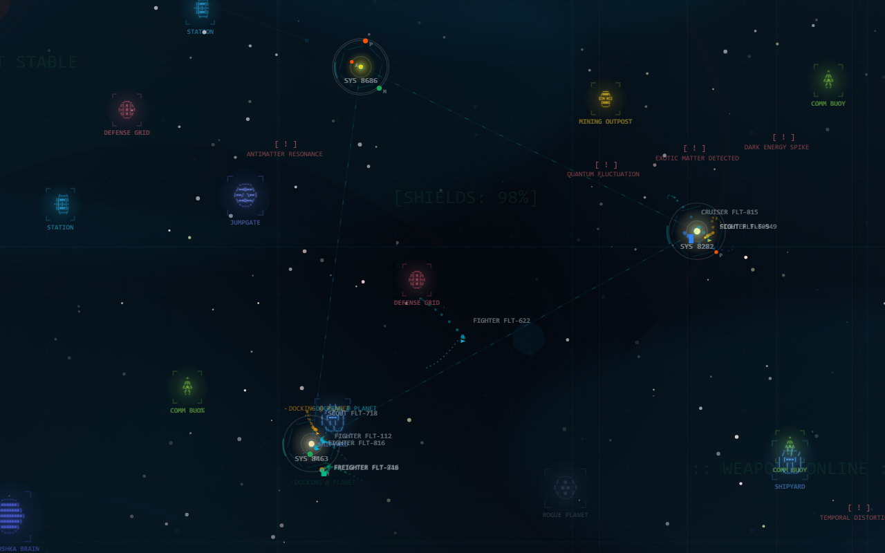

# Aesthetic Background Engine

A lightweight, zero-dependency engine for dropping premium, generative backgrounds into any web project.


| calm-mesh | aurora-night | terminal-rain | fireflies |
| --- | --- | --- | --- |
|  |  |  |  |
| deep-field | flow-lines | paper-grid | void-sector |
|  |  |  |  |

*Every image above is a test baseline: the same seed renders these pixels on every run.*

Creating beautiful, animated canvas backgrounds that play nicely with the DOM is notoriously tedious. This engine abstracts away the boilerplate: DOM injection, container-aware sizing, devicePixelRatio scaling, a throttled frame loop with a real clock, reduced-motion and hidden-tab handling, seeded generation, palette tokens, pointer input, a frame-time quality governor, and clean teardown.

You provide a **skin** (the visual aesthetic), and the engine handles the rest.

The default skin (`void-tactical`) is a sci-fi sector map, but the engine is theme-agnostic. It runs any generative aesthetic, from calm gradients and particle networks to glyph rain and abstract geometry.

Page content stays fully clickable (`pointer-events: none` on the whole background stack).

> **Status:** early. The architecture, current gaps, and the plan are in [docs/ROADMAP.md](docs/ROADMAP.md). The API below is stable enough to try, not yet to depend on.

## 30-Second Drop-In

**Via CDN (Web Component):**

```html
<script type="module" src="https://unpkg.com/space-background-engine/dist/element.js"></script>
<bg-engine seed="orion-7" detail="low"></bg-engine>
```

Pick a built-in skin, derive a palette from your brand color, and dial the presence down:

```html
<bg-engine skin="matrix-rain" palette="#ff7a1a" intensity="0.6"></bg-engine>
```

**Via Vanilla JS:**

```html
<div id="bg"></div>
<script type="module">
  import { mount } from 'https://unpkg.com/space-background-engine/dist/index.js';

  // Full-page background behind everything
  mount(document.body, { seed: 'orion-7', detail: 'low' });

  // Or inside a positioned container, with a skin picked by id
  mount('#bg', { skin: 'drifting-dust', palette: 'violet', intensity: 0.5 });
</script>
```

`mount()` returns a handle with `canvas`, `root`, `pause()`, `resume()`, `renderOnce()`, and `destroy()`.

## Installation

```bash
pnpm add space-background-engine
```

Import only what you use. `core` has no skins; each skin registers itself when imported:

```ts
import { mount } from 'space-background-engine/core';
import 'space-background-engine/skins/matrix-rain';

mount('#hero', { skin: 'matrix-rain' });
```

The bare package import (`space-background-engine`) is batteries included: the core, every built-in skin, the standard layer library, and the curated presets.

**Presets** are the fastest path to a good result. Each is a tuned scene with its own palette and intensity defaults, registered like a skin:

```ts
import { mount } from 'space-background-engine/core';
import 'space-background-engine/presets';

mount(document.body, { skin: 'calm-mesh' });                       // light SaaS plate
mount('#hero', { skin: 'aurora-night', palette: '#22d3ee' });     // override the palette
```

| Preset | Niche | Theme |
| --- | --- | --- |
| `calm-mesh` | SaaS landing, marketing | light |
| `aurora-night` | SaaS, events | dark |
| `terminal-rain` | developer portfolios | dark |
| `deep-field` | space, sci-fi (no HUD) | dark |
| `flow-lines` | data, science, analytics | dark |
| `fireflies` | nature, wellness, quiet portfolios | dark |
| `nebula-drift` | space, music, events | dark |
| `ink-wash` | editorial, studios, portfolios | light |
| `paper-grid` | editorial, brutalist | light |

**React:**

```tsx
import { Background } from 'space-background-engine/react';

export function App() {
  return (
    <>
      <Background seed="orion-7" detail="low" palette="void-cyan" />
      <main>{/* your site content goes here */}</main>
    </>
  );
}
```

`Background` wraps `mount()`. Any prop change tears the background down and mounts it again with the new settings. The built React entry is marked `'use client'`, so it works as-is in the Next.js App Router.

**Vue, Svelte, Astro, no build step.** Each adapter is a thin layer over `mount()` with no framework dependency of its own:

```ts
// Vue 3: a directive
import { BackgroundPlugin } from 'space-background-engine/vue';
app.use(BackgroundPlugin);           // <section v-background="{ skin: 'calm-mesh' }" />

// Svelte: an action
import { background } from 'space-background-engine/svelte';   // <div use:background={{ skin: 'deep-field' }} />
```

Astro and plain HTML use the `<bg-engine>` element. Without a bundler, an import map pins a version from a CDN; see [examples/importmap.html](examples/importmap.html).

## Copy a background into your project

The CLI reads the registry and writes one editable file, so the scene lives in your repo where you and your agent can change it, while the engine stays a dependency:

```bash
npx space-background-engine list --kind preset
npx space-background-engine info aurora-night
npx space-background-engine add aurora-night --palette '#ff7a1a' --intensity 0.6
npx space-background-engine add calm-mesh --tokens ./design/tokens.json
```

`add` writes `src/backgrounds/<id>.ts` with the manifest inlined and a `mountBackground()` function. `--tokens` derives the palette from a brand token file.

## Community presets

A preset is data: a scene plus config defaults. Anyone can publish one as JSON without shipping code, because every layer validates its options against a schema before anything mounts.

```ts
import { mount } from 'space-background-engine';
import { loadPresetManifest } from 'space-background-engine/manifest';

const preset = await loadPresetManifest('https://example.com/ember-nocturne.json');
mount(document.body, { skin: preset });
```

`validatePresetManifest()` reports every problem with a path (`scene.layers[1].with.style: "hexagons" is not one of dots, lines, cross`). Point `"$schema"` at `registry/preset.schema.json` and editors autocomplete layer ids and every option with its range. To list a preset in the gallery, add its JSON to [registry/community](registry/community) in a pull request; CI validates it and it appears in the studio with no code change. In the studio, `?preset=<url>` loads and selects any manifest.

## Palette tokens on your page

Pass `exposeTokens: true` and the background's palette is written as `--bge-*` variables on `<html>`, so your own UI can follow it. With Tailwind:

```css
/* Tailwind v4 */
@import "tailwindcss";
@import "space-background-engine/tailwind.css";   /* bg-bge-bg, text-bge-ink, border-bge-accent, ... */
```

```js
// Tailwind v3
import bge from 'space-background-engine/tailwind-preset';
export default { presets: [bge] };                  // supports opacity: bg-bge-accent/20
```

To share the palette with design tools, `paletteToTokens()` (from `space-background-engine/tokens`) exports W3C DTCG tokens that Figma Variables importers and Tokens Studio read, and `paletteFromTokens()` derives a palette from an existing token file. Both are buttons in the studio.

## Configuration Knobs

| Option | Default | Description |
| --- | --- | --- |
| `seed` | random | PRNG seed. The same seed replays the same world, frame for frame. |
| `skin` | `'void-tactical'` | A skin object or the id of a registered skin (`'void-tactical'`, `'drifting-dust'`, `'matrix-rain'`). |
| `options` | `{}` | Skin-specific options. See each skin's exported options type. |
| `palette` | `'void-cyan'` | A built-in id (`void-cyan`, `amber`, `violet`), a full token object, a bare hex color, or `{ from: '#hex', theme: 'dark' \| 'light', harmony }` to derive a palette in OKLCH. `harmony` (`analogous`, `complementary`, `split`, `triadic`, `mono`) sets the two secondary hues `accent2` and `accent3`. |
| `exposeTokens` | `false` | Also write the palette as `--bge-*` variables on `<html>` (or a given element) for your own UI. |
| `intensity` | `1` | One knob for how much the background asserts itself. Skins scale motion, density, and contrast by it. `0` to `1`. |
| `motion` | `'auto'` | `auto` honors `prefers-reduced-motion`; `full`, `reduced`, or `off` force a mode. `off` renders a single frame. |
| `density` | `1` | Population multiplier for generated entities (clamped 0.25–2). |
| `light` | seeded | `{ angle, warmth }`. One key light every layer reads. Omit `angle` and the seed picks an upper corner; `warmth` runs from cool (`-1`) to warm (`1`). |
| `legibility` | `'auto'` | Measure the page's content boxes (`main, article, [data-bg-content]`) and make the background recede behind them, adding a feathered shade above `intensity` 0.55. `'off'`, or `{ selector, strength }` for a fixed shade. |
| `quiet` | `[]` | Extra quiet zones as viewport fractions `{ x, y, width, height }`, for content the selector cannot see. |
| `detail` | `'low'` | Label / HUD budget for the default skin (`none`, `low`, `medium`, `high`). |
| `cameraSpeed` | `0.25` | Base drift speed, in world units per frame at 60 fps. Real speed is time-based. |
| `targetFps` | `60` | Frame cap for the render loop. Lowering it does not slow the animation. |
| `adaptiveQuality` | `true` | Lower `host.quality` when frames run over budget and raise it back when they recover. |
| `zIndex` | `0` | z-index of the background root. |
| `fonts` | `false` | Load the display fonts used by built-in canvas text (Orbit, Syne Mono) from Google Fonts. Off by default so the package makes no network requests. |

`<bg-engine>` attributes: `seed`, `skin`, `palette`, `intensity`, `motion`, `density`, `detail`, `speed`, `fps`, `fonts`, `z-index`, `light-angle`, `warmth`, `legibility` (`auto` or `off`).

## What the engine guarantees today

- **Deterministic replay.** `Math.random`, `Date.now`, and timers are banned from skins; the host hands each frame seeded random streams and a clock. Two instances with the same seed issue identical draw calls, which the test suite checks for every built-in skin.
- **Time-based motion.** Skins receive `dt` in seconds (clamped after stalls), so animation speed is independent of frame rate and of `targetFps`.
- **Motion policy.** `prefers-reduced-motion` is honored by default: skins see `motion: 'reduced'` and a halved `intensity`; `off` renders one static frame and stops the loop.
- **Pauses when unseen.** The loop stops while the tab is hidden or the canvas is scrolled offscreen, and resumes without a time jump.
- **Container-aware sizing.** The canvas fills whatever it is mounted in and follows it through a `ResizeObserver`, with a window fallback. Backing store is scaled by `devicePixelRatio`, capped at 1.5x.
- **Scoped styling.** Palette tokens are written as `--bge-*` custom properties on the engine root only, never on your `:root`.
- **DOM isolation and clean teardown.** Everything lives in a `.bg-engine-root` with `pointer-events: none`; `destroy()` removes the DOM, disconnects observers and listeners, cancels the loop, and is safe to call twice.
- **Text stays readable.** By default the host finds your content boxes, motion layers thin out behind them, and busy scenes get a feathered shade. Every built-in preset holds a mean 7:1 contrast behind a text column in the browser gates.
- **Zero dependencies, small by default.** The host is about 15 KB gzipped; each small skin adds about 5 KB. Budgets are enforced in CI.

## Scenes and Layers

Under the presets sits a composable model. A **layer** is one effect with a declared option schema. A **scene** is JSON: an ordered stack of layer references, bottom to top, each with options, opacity, and a blend mode. The `scene` skin runs any scene, so a background can be authored, tuned in the playground, and pasted into `mount()` with no code:

```ts
import { mount } from 'space-background-engine/core';
import 'space-background-engine/layers';

mount(document.body, {
  skin: 'scene',
  palette: { from: '#ff7a1a' },
  intensity: 0.7,
  options: {
    layers: [
      { use: 'gradient-base', with: { tint: 0.3 } },
      { use: 'starfield', with: { density: 0.8, bands: 3 } },
      { use: 'aurora', with: { bands: 2 }, blend: 'lighter', opacity: 0.8 },
      { use: 'vignette' },
      { use: 'grain', with: { opacity: 0.08 } },
    ],
  },
});
```

Standard layers: `gradient-base`, `mesh-gradient`, `aurora`, `starfield`, `particles-drift`, `plexus`, `flow-field`, `glyph-rain`, `grid`, `light-follow`, `vignette`, `content-shade` (a feathered shade behind your text column so any scene passes a contrast check), `moments` (rare seeded events, below), `grain`, `scanlines`. Any whole skin can also be used as a layer (`fromSkin`), and `void-tactical` registers itself that way. Every layer reads colors from the palette or from tokens like `accent` and `inkDim`, scales itself by `intensity` and `quality`, and draws deterministically from the seeded streams.

Options are validated against each layer's schema: numbers are clamped, unknown enum values fall back to defaults, and nothing throws on a typo in a JSON preset. The same schema drives the playground controls and is what an agent fills in when it builds a scene for you.

### Shader layers

Layers can render on the GPU. `createShaderLayer` takes a GLSL ES 3.00 fragment shader and gives it a private WebGL2 surface composited like any other layer. Uniforms arrive from the frame (`u_time`, `u_dt`), the host (`u_resolution`, `u_pointer`, `u_intensity`, `u_quality`, `u_seed`), the palette (`u_bg`, `u_accent`, `u_accent2`, `u_accent3`, `u_ink`, `u_hazard`), the scene light (`u_lightDir`, `u_lightPos`, `u_warmth`), and every numeric, boolean, and color field in your schema as `u_<name>`. A prelude provides `hash21`, `vnoise`, and `fbm`.

```ts
import { createShaderLayer } from 'space-background-engine/shader';
import { registerLayer } from 'space-background-engine/core';

registerLayer(createShaderLayer({
  id: 'haze', label: 'Haze', schema: { scale: { type: 'number', min: 1, max: 6, default: 3 } },
  fragment: `void main() {
    float n = fbm(v_uv * u_scale + u_time * 0.05, 4);
    float a = smoothstep(0.0, 0.8, n) * 0.4 * u_intensity;
    fragColor = vec4(u_accent * a, a);
  }`,
}));
```

Because every input is a uniform, shader layers stay deterministic: the same seed renders identical pixels. Built-in shader layers are `nebula` and `ink-flow`. Where WebGL2 is unavailable the layer logs once and is skipped, and the rest of the scene renders normally. If the GPU drops the context, the layer pauses and rebuilds its program when the context is restored. Heavy layers can set `rate: 0.5` to render every other frame.

To publish your own preset, wrap a scene:

```ts
import { registerPreset } from 'space-background-engine/core';

registerPreset({
  id: 'ember-field',
  label: 'Ember field',
  tags: ['dark', 'warm'],
  config: { palette: { from: '#f97316' }, intensity: 0.8 },
  scene: { layers: [{ use: 'gradient-base' }, { use: 'particles-drift', with: { glow: 0.9 } }] },
});
```

## Light, quiet zones, moments, transitions

Layers in a scene agree with each other because the host gives them a shared composition.

- **One key light.** `host.light` holds an angle, a unit direction, an in-frame key position, and a warmth. `gradient-base` puts its main glow at the key and a fill light opposite. `vignette` opens toward the light. The `nebula` shader lights the side of each cloud that faces the key, and `moments` aims comet tails and flare spikes by it. Shader layers receive `u_lightDir`, `u_lightPos`, and `u_warmth`. By default the seed places the light in an upper corner, never top center; set `light: { angle: 225, warmth: 0.4 }` to pin it.
- **Quiet zones.** With `legibility: 'auto'`, the host measures your content boxes on mount, resize, and scroll. `host.quiet(x, y)` returns 0 to 1 near those boxes with a soft falloff. Particles, stars, plexus links, glyph-rain heads, and flow lines recede there (each layer's `quiet` option sets how much), so text sits on calm ground instead of under a shade box. At high `intensity` a feathered shade is added too.
- **Moments.** The `moments` layer stages rare, seeded events: a meteor every minute or so, a slow comet, a star that flares. Gaps are random and long, events avoid your text, and the same seed stages the same events at the same seconds. Under reduced motion only flares remain.
- **Transitions.** `transition(handle, nextOptions, { kind, duration })` mounts the next scene in place and reveals it with `crossfade`, `wipe` (from the lit side), or `iris` (opening from the new scene's key light). It is driven by the incoming scene's own clock, so it replays deterministically. It is instant with motion off, and a crossfade under reduced motion. In React, pass `transition` to `<Background>`.

```ts
import { mount, transition } from 'space-background-engine';

let bg = mount(document.body, { skin: 'deep-field', light: { warmth: -0.2 } });
// later, when the page changes section:
bg = transition(bg, { skin: 'aurora-night' }, { kind: 'iris', duration: 1.4 }).handle;
```

`handle.composition()` reports the light, the measured content rects, the quiet zones, and the current shade strength, and `handle.onFrame(fn)` subscribes to frames. The studio's "Show composition" overlay draws all of it over the live background.

## The void-tactical skin

The default skin is a streaming sci-fi sector map: star systems with orbiting planets and hex radars, a network of data lanes between systems, ASCII-art structures from stations to Dyson spheres, fleets with AI states and predicted paths, anomalies, and an ambient HUD of sector chatter. Every authored color is pulled into the active palette family, so it works with `palette: '#ff7a1a'` as well as the built-ins. It is calibratable through `options`:

| Option | Default | Effect |
| --- | --- | --- |
| `hueVariety` | `0.94` | `0` pulls every entity into the palette family, `1` keeps the original rainbow. |
| `lineWeight` | `1.7` | Multiplier on all strokes. |
| `spriteScale` | `0.95` | Size of the ASCII structure art. |
| `hud` | `0.52` | Opacity of grid, sector links, labels, telemetry, and overlay text. |
| `paths` | `'dots'` | Fleet predicted paths: `dots`, `dashed`, or `off`. |
| `trails` | `0.92` | Fleet history trail opacity. |
| `gradient`, `mesh`, `asciiGrid`, `ascii1`, `ascii2`, `clouds`, `noise`, `mouseGlow`, `starfield` | all on except `starfield` | Toggle each CSS atmosphere layer. |

The skin's own config defaults are `intensity: 0.45`, `density: 1.5`, `detail: 'high'`, `palette: 'void-cyan'`: a dense, fully annotated sector held back to 45% presence so page content leads. Pass any of those to `mount()` to override. Two instances with the same seed replay identically.

The same simulation is also available as **layers** that share one world per mount: `void-atmosphere` (the CSS plate), `void-stars`, `void-systems`, `void-fleets`, and `void-hud`. The `void-sector` preset is the skin rebuilt from them, so in a scene you can drop the HUD, dim the fleets to half opacity, or slide `grain` and a `content-shade` between the systems and your text, while fleets still steer toward the structures the systems layer draws:

```ts
mount(document.body, {
  skin: 'scene',
  intensity: 0.45,
  density: 1.5,
  detail: 'high',
  options: {
    layers: [
      { use: 'void-atmosphere' },
      { use: 'void-stars' },
      { use: 'void-systems', with: { spriteScale: 1.2 } },
      { use: 'void-fleets', with: { paths: 'off' }, opacity: 0.6 },
      { use: 'content-shade', with: { strength: 0.5 } },
    ],
  },
});
```

## Using it with an AI agent

The repository ships a skill, `skills/background-designer/SKILL.md`, that turns a conversation into a background: an intake questionnaire, a decision procedure (preset, then scene, then layer, then skin), the conventions the gates enforce, a catalog of everything registered, and taste notes. Claude Code picks it up from `.claude/skills/`; for other tools, paste the skill file and its `references/` into the agent's context. Because every option is declared in a schema and every render is deterministic, an agent can propose a `mount()` call, you can paste it, and the result is exactly what it described.

## Authoring

```bash
pnpm create-skin ember-drift --label "Ember drift" --tags "warm,calm"
pnpm skin:check ember-drift --update
```

The scaffold writes a skin that already follows the conventions (seeded randomness, `dt`-based motion, palette colors, a schema, cleanup), registers it, and adds it to the browser gates. `skin:check` runs typecheck, unit determinism, screenshot, contrast behind a text column, and pixel-identical replay, and prints the path of the reference render so you iterate on the picture. `example-motes` in the repo is the scaffold's unedited output. See [CONTRIBUTING.md](CONTRIBUTING.md).

## Custom Skins

The engine separates the **Host** (sizing, loop, clock, config, palette, inputs) from the **Skin** (world generation and drawing). A skin is a small object:

```ts
import type { BackgroundSkin } from 'space-background-engine/core';
import { rgba } from 'space-background-engine/core';

export const ripples: BackgroundSkin<{ rings?: number }> = {
  id: 'ripples',
  mount({ ctx, rng, palette, options, viewport, pointer }) {
    const rings = options?.rings ?? 6;
    const seeds = Array.from({ length: rings }, () => ({ x: rng(), y: rng(), phase: rng() * 4 }));
    return {
      resize() {},
      frame({ t }) {
        const { width, height } = viewport;
        ctx.clearRect(0, 0, width, height);
        ctx.strokeStyle = rgba(palette.accentRgb, 0.25);
        for (const s of seeds) {
          const r = ((t + s.phase) % 4) * 60;
          ctx.beginPath();
          ctx.arc(s.x * width, s.y * height, r, 0, Math.PI * 2);
          ctx.stroke();
        }
        if (pointer.active) {
          ctx.beginPath();
          ctx.arc(pointer.x, pointer.y, 40 + Math.sin(t * 3) * 6, 0, Math.PI * 2);
          ctx.stroke();
        }
      },
      destroy() {},
    };
  },
};
```

What the host gives a skin (`SkinHost`):

| Field | Purpose |
| --- | --- |
| `canvas`, `ctx` | The 2D context, already DPR-scaled. |
| `rng`, `fork(label)`, `noise` | Seeded random stream, independent sub-streams, seeded 2D simplex + fbm. |
| `config`, `options`, `palette` | Resolved config, skin options, palette tokens as values (never read CSS variables). |
| `viewport` | Live `width`, `height`, `dpr`, `isMobile`, `isTouch`. |
| `pointer` | Live position, velocity, `active`, `down`, seconds `idle`. |
| `motion`, `intensity`, `quality` | Live policy and budgets to scale your effect by. |
| `light` | Scene key light: `angle`, unit `dx`/`dy`, key position `x`/`y` (0 to 1), `warmth`. |
| `quiet(x, y)` | 0 to 1: how close a CSS-pixel point is to page content. Recede there. |

Each frame receives `{ t, dt, frame, timestamp }` in seconds. Rules that keep skins portable: no `Math.random`, `Date.now`, `performance.now`, or timers; move by `dt`; read colors from `host.palette`; release everything in `destroy()`.

Then either pass the object (`mount(el, { skin: ripples })`) or register it once and use the id everywhere, including `<bg-engine skin="ripples">`:

```ts
import { registerSkin } from 'space-background-engine/core';
registerSkin(ripples);
```

Skins can also add GPU-friendly DOM layers behind the canvas (gradients, SVG textures, grain) by implementing the optional `layers(root, context)` hook. The default skin uses it for its atmosphere stack.

Testing a skin: `createManualScheduler()` drives the loop by hand, so a test can step 240 frames and compare draw-call hashes for two seeds. See `src/engine/skins/determinism.test.ts`.

See the [Direction & Architecture Guide](docs/DIRECTION.md) for the contract and [docs/ROADMAP.md](docs/ROADMAP.md) for where the contract is heading.

---

## Local Development

```bash
pnpm install
pnpm dev          # Interactive playground (localhost:5174)
pnpm test         # Unit, DOM, and determinism tests (vitest, jsdom)
pnpm test:e2e     # Real-browser gates (Playwright): screenshots, contrast, pixel-identical replay
pnpm typecheck    # tsc across app and tooling configs
pnpm build:lib    # Library bundle + generated type declarations
pnpm size         # Gzip budget per entry closure (run after build:lib)
```

**Browser gates.** `pnpm test:e2e` renders every built-in skin and preset through `/check.html`, a harness that mounts with a manual clock at a fixed seed and steps a fixed number of frames, so each render is reproducible. For each subject it asserts three things: the render matches its stored screenshot in `e2e/__screenshots__` (visual regression, per platform), the palette ink reaches a mean WCAG contrast of 7:1 (AAA) over the canvas behind a 40rem text column, with at most 5% of sampled pixels below AA, and two independent browser contexts produce byte-identical PNGs for the same seed. After an intentional visual change, refresh baselines with `pnpm test:e2e:update` and commit them. The first run on a new platform writes its own baselines.

The playground at `/` is a scene studio: browse the preset gallery, edit the layer stack with controls generated from each schema, derive a palette from a brand color, undo and redo with Ctrl/Cmd+Z, hit **Randomize** to perturb every option inside its schema range, and **Fit shade** to place a legibility mask over the page's content column. Set the key light's angle and warmth, switch legibility between auto and off, pick the transition used when you change presets, and turn on **Show composition** to see thirds, the light ray, measured content boxes, and quiet zones over the live render. Export a `mount()` call, a preset JSON, a PNG or WebP (DOM layers included), or an 8 second WebM loop rendered on a fixed clock. The URL hash holds the whole state, so a link reproduces the exact background. Run `pnpm sync-gallery` once to populate the gallery thumbnails from the test baselines.

Smoke pages served by the dev server: `/quick.html` (`mount(document.body)`), `/element.html` (`<bg-engine>`), `/skins.html` (container mounts with skin ids and palettes).

**Blind compare.** `pnpm compare` stages every current baseline next to its render from the 0.2.0 release (0.3.0 for presets added since) in `public/compare`. `/compare.html` then shows each pair with shuffled sides and a flip view, and reveals which version you preferred only at the end. It is how an aesthetic change is accepted: the maintainer has to prefer the new render without knowing which one it is.
