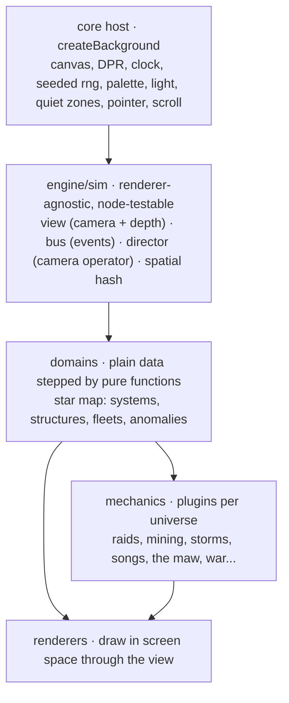
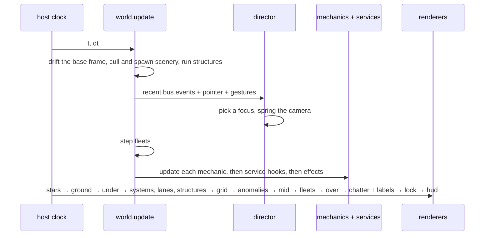
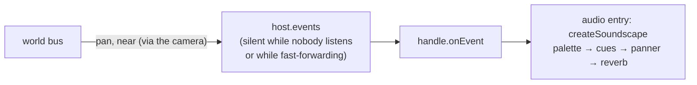
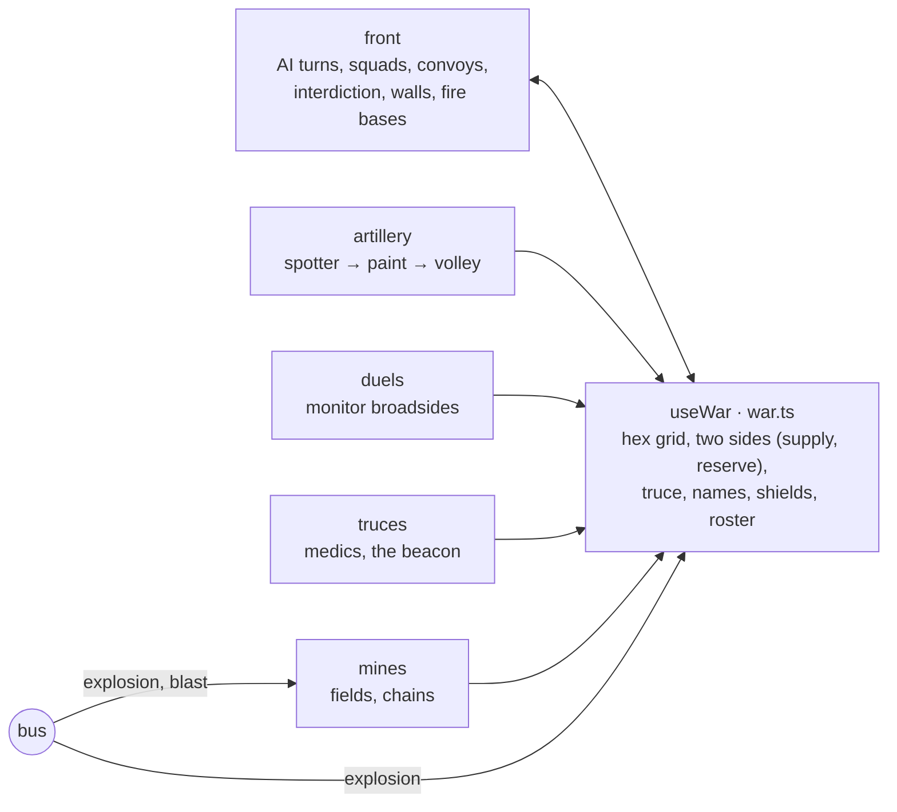
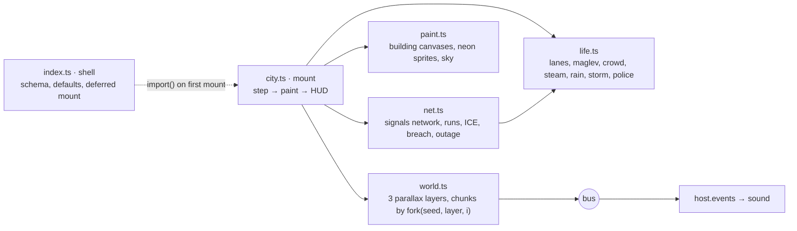

# Architecture

How the engine is put together, for anyone (or any agent) extending it. The README
says what it does; [REFERENCE.md](REFERENCE.md) lists the API. This page explains how the
pieces fit, and the conventions that keep them fitting.

## Layers



- **Host** (`engine/core`). Sizes the canvas, runs the clock, and owns the user-facing
  policies: reduced motion, pausing, the quality governor, legibility. It knows nothing
  about any particular background.
- **Sim** (`engine/sim`). Small modules with no DOM: the `View` (camera and projection),
  the `Bus` (event stream), the `Director` (camera operator), and a spatial hash. A node
  test can import any of them directly.
- **Domain**. The star map's world (`skins/void-tactical/world.ts`) holds plain data and
  steps it with pure functions (`fleets.ts`). Randomness comes from named, seeded streams
  (`host.fork('fleets')`), so a seed replays exactly.
- **Mechanics**. Plugins that own a piece of what happens: they spawn and steer fleets,
  emit events, and draw at a pass. A universe pack lists the ones it runs.
- **Renderers**. Free functions that draw the domain, projecting every point through
  the view.

## One frame



`SkinInstance.advance(info)` runs the update without drawing. The host uses it for time
scale above 1 and `fastForward`; the lab and the headless runner use it to skip ahead cheaply.

## Space, the camera, and depth

World space: x grows right (the map streams this way), y grows down, z is depth (0 is
the main plane, larger is farther). The view projects a point as

```
s  = zoom / (1 + z)
sx = W/2 + (x - camera.x) * s
sy = H/2 + (y - camera.y) * s
```

Two frames matter:
- the **base frame**: where the camera would be with no director (the steady drift, zoom 1).
  Spawning, culling, and behavior decisions use it, so they never depend on where the
  camera happens to look.
- the **camera**: what is drawn. The director (or the user, in interactive mode) can zoom
  in, never out, and look around only inside the base frame, so nothing unpopulated shows.

Depth gives the map volume: `look.depth` of the scenery sits on far planes (z 0.55 and 1.1),
smaller, dimmer, and slower. Fleets carry a `z` too; a plan eases depth from `z0` to `z1`,
so a freighter bound for a far station sinks into the distance as it flies.

**Rendering rule.** Core renderers project every point (`view.sx/sy`) and scale sizes by
`view.scale(z)`. Text is always drawn at its pixel size at a projected point, and sprites
are re-rasterized at the nearest font size, so nothing blurs at any zoom.

**Mechanic rule.** Mechanic draw passes run inside the camera transform. Draw in *map
space* (`api.screenX(x)`, world `y`), as if the camera never moved; pan and zoom apply on
their own. The exception is the `hud` pass, which is screen space (tickers, readouts).
Mechanics live on the main plane: skip anything with `z`.

**Ground.** `look.ground` (`dust`, `nebula`, `mist`) adds terrain on a plane at z 0.25. It is
seamless value noise baked into small cached tiles (`renderers/ground.ts`).

## Events

Everything noteworthy goes on the bus as a plain object:

```ts
api.emit({ type: 'raid', x, y, weight: 0.85, color, follow: api.follow(target) });
```

`weight` (0..1) is how much it matters. The director uses it to choose what to look at,
audio uses it for loudness, and tooling uses the log.

Events also leave the skin. The world forwards every bus event to `host.events`, adding
where it is across the screen (`pan`) and how near it is. The host fans these out to
`handle.onEvent` listeners:



The forwarder checks `host.events.active` first, so a page without sound pays nothing.
The audio entry (`engine/audio`) is the only consumer shipped. It never touches the sim. `follow` lets the camera track a
moving subject until it is gone. Lines said on the map are `say` events. High-priority
lines also emit an `alert`, so even a mechanic that never emits anything still draws the
camera's attention.

## Services

Shared, renderer-agnostic pieces in `engine/sim`, attached to a world on first use:

| Module | What it is | Used by |
|---|---|---|
| `economy.ts` (ledger) | Goods held at places; producers, consumers, shortages, prices | `economy` (convoys, shipyards, manifests, ticker), miners, wardens |
| `signals.ts` (network) | Nodes, nearest-k links, hop-by-hop packets, ring broadcasts | `relays` (messages, distress) |
| `fields.ts` (flow field) | Sum of wind, moving bands, vortices, curl noise | `weather` → storms, drifting rock; spore flocks; nebula gas |
| `spatial.ts` | Uniform grid hash | collisions, neighbour queries |
| `bodies.ts` | A steering head and a spine that follows at fixed spacing | leviathans, the Mouth's tendrils, the Last Fleet's ark |
| `history.ts` | A ring of past positions, nearest-moment lookup | echoes |
| `cells.ts` | A lazily seeded hex grid: owner, hold, a free value, and ownership history per cell; `cellHash` for order-free jitter | the Siege's territory (`front`), the Hive's creep (`bloom`) |

Body ids come from the caller, kept per world; a module-level counter would make a
second mount number its bodies differently and break replays. Likewise, a cell's starting
state comes from a hash of its coordinates rather than the rng, so it doesn't matter which
code touches a cell first.

Domain bindings live next to their mechanics: `useLedger(api)` (economy.ts), `useNetwork(api)`
(relays.ts), `useWeather(api)` (weather.ts), `useWar(api)` (war.ts), `useBloom(api)` (hive.ts),
`useArk(api)` (lastfleet.ts), and `useCosmos(api)` (cradle.ts). Each one creates its service once
per world and registers that service's update and draw hooks.

**Many cheap things.** When a universe needs hundreds of moving things (the flotilla, spores,
nebula gas), they are plain particles owned by a mechanic, not fleets: no labels, no AI, no
trails, batched into a few paths per frame. Only the things that fight, dock, or speak are
fleets. Gas updates half its particles per frame at twice the step.

### The Siege's war



Every siege mechanic spends from its side's `reserve`, so offensives, volleys, duels, and
minelayers compete for the same budget. That competition gives the war its rhythm: a side
saves up, spends it, and goes quiet. `inTruce()` stops them all. Ships that fight for a
side go on the roster (`enlist`), which is how fire bases and artillery choose whom to hit.
Mines spare their own faction's ships, since they know the safe lanes.

## Undercity (a second world model)

Undercity (`skins/undercity`) is not a star map, but it is built from the same parts:



- **Streaming.** Each layer is cut into chunks; a chunk's buildings come from a stream forked
  by `(layer, index)`, so the city is the same whatever order chunks are visited in.
- **Paint once, stamp often.** The static parts of a building are rasterized once into a small
  canvas (far layers at lower resolution, since they sit in the smog) and dropped when they
  scroll away. Only what changes is drawn live.
- **Screen-space net.** Nodes sit on buildings across different parallax layers, so the net
  works in screen space: node positions are refreshed in place every frame, and links are
  rebuilt only when buildings stream in or out.

## Loading on demand

The sector map's static bundle is the engine and the classic pack's data. Everything else
loads when a scene asks for it:
- **Universes** register a loader with metadata (`registerUniverseLoader`). `listUniverses()`
  shows them all, and `loadUniverse(id)` fetches one.
- **Mechanics** register a loader per id (`mechanics/index.ts`). A world starts once its
  universe and every mechanic it runs are loaded. Until then the skin shows the plain plate.
- `prepareVoidTactical(options)` loads both up front. The harnesses call it so that frame 0 is
  the real first frame.
- The studio, tests, and the headless runner import `packs` and `mechanics/all` eagerly.
- Plugins register by side effect, so their modules are listed in `package.json`
  `sideEffects`. `pnpm size` fails if the built output is missing any built-in mechanic.

## Extending

A mechanic:

```ts
registerMechanic({
  id: 'patrol', label: 'Patrols', description: '…',
  schema: { rate: { type: 'number', min: 0.1, max: 2, default: 0.5 } },
  create(api, params) {
    return {
      update(dt) { /* spawn, steer, emit */ },
      draw(ctx, pass, frame, board) { /* map space */ },
    };
  },
});
```

A shared service (an economy, a signal network, a flow field) is a module that exports a
`useX(api)` accessor:

```ts
export const useLedger = (api: MechanicApi) => api.use('ledger', () => {
  const ledger = createLedger();
  api.onUpdate((dt) => ledger.tick(dt));
  api.onDraw('mid', (ctx) => ledger.draw(ctx));
  return ledger;
});
```

It is created on first use, shared by every mechanic that asks for it, and never shipped
or run by a universe that does not import it.

Conventions:
- No `Math.random`, `Date.now`, or timers. Fork a stream: `host.fork('my-thing')`.
- Move by `dt`. Never assume 60 fps.
- Factory functions returning a documented interface (`createX(): X`), plain data objects,
  pure step functions. A comment at the top of each file says what it is for.
- A mechanic that throws is switched off with a warning; the scene keeps running.

## Fast checks

| Tool | What it does | Typical time |
|---|---|---|
| `pnpm sim choir 90` | Steps a universe sim-only in node and prints counts, the event log, and problems (NaN, empty fleets, runaway counts, failed mechanics). Exits 1 on problems. | ~1–4 s |
| `pnpm lab u=siege seek="FALLS TO" after=0.5,3,8` | One browser page: fast-forwards to a moment and saves a contact sheet PNG. Also `t=…`, `every=…`, `crop=…`, `dsf=2`, `opt.camera=cinematic`. | ~2–6 s |
| `?debug` in the studio | Time scale ×1/×4/×16, skip 30 s, live counts, the event log. | live |
| `*.sim.test.ts` | Node-environment tests built on the headless runner. | seconds |
| `pnpm test:e2e` | Screenshot, contrast, and replay gates in a real browser. | minutes |

Typecheck with `pnpm typecheck` (`tsc -b`).
