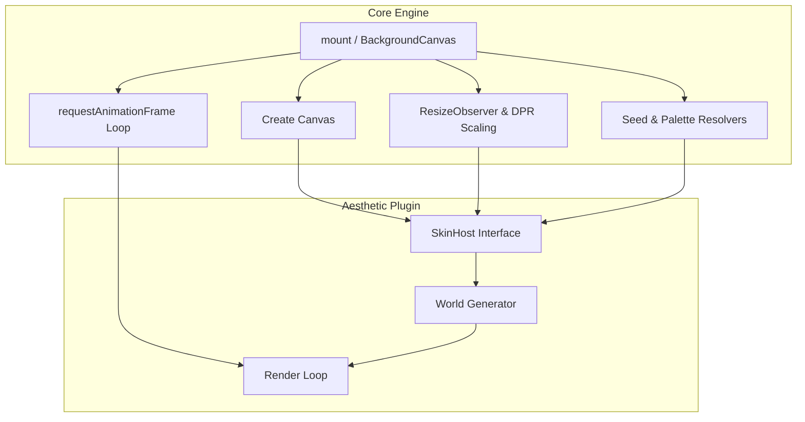

# Direction & Architecture

The Aesthetic Background Engine is a tool for dropping premium, generative, interactive backgrounds into any web project. 

The original aesthetic—a sci-fi sector extracted from a landing page (`void-tactical`)—is just the default "skin". **The true product is the engine itself:** a highly generalizable framework that handles all the tedious boilerplate of canvas backgrounds (resizing, DPR scaling, requestAnimationFrame loops, detail budgets, seeded PRNG) so developers can focus purely on aesthetics.

Local notes that must never ship: `docs/PRIVATE.md` (gitignored).

---

## The Vision: A Community of Aesthetics

Creating a custom canvas background is often too much work for a standard web project. This engine changes that by providing a robust host environment. 

The goal is to build an open-source ecosystem where anyone can write and share cool aesthetics (skins). Whether you want a calm drifting gradient, a brutalist ASCII terminal, a particle network, or abstract generative art, the engine handles the mounting, while the skin just handles the drawing.

---

## Architecture: Host vs. Skin

The architecture cleanly separates the plumbing from the art.



**The Host (`core`)**
- Manages the `canvas` element, DOM injection, and resize observers.
- Runs the `requestAnimationFrame` loop, throttled to a `targetFps`.
- Provides the skin with a deterministic PRNG (`rng`), canvas context (`ctx`), and the parsed configuration (budget, seed).

**The Skin (`skins/*`)**
- Implements the simple `BackgroundSkin` interface.
- Owns its internal state, entities, and drawing logic.
- Can accept arbitrary `options` extending the generic `<SkinOptions>` type for custom aesthetic knobs.
- Knows nothing about React, Web Components, or the DOM.

---

## Conceptual Primitives

To truly understand the engine's generalizability, it is built on a few core mechanisms:

1. **Deterministic PRNG**: The engine replaces `Math.random()` with a Mulberry32 seeded generator. This means that if two users pass `seed="orion"`, they are mathematically guaranteed to generate the exact same constellation, network, or particle layout, regardless of their browser.
2. **DOM Isolation**: The engine creates an absolute/fixed positioned `<div class="bg-engine-root">` with `pointer-events: none`. The background renders beautifully behind your content without ever interfering with clicks, scrolls, or layout.
3. **Hardware Acceleration**: Heavy ambient visual effects (like SVG turbulence, radial gradients, or CSS grids) are offloaded to isolated DOM layers. Skins can inject these layers underneath the canvas, relying on GPU-accelerated CSS rather than choking the Canvas 2D context.
4. **Generic Configuration**: While the engine defines global budgets (`density`, `detail`, `cameraSpeed`), every skin can define its own specific schema via the `<T>` generic (e.g., `options: { maxNodes: 100 }`), automatically flowing down from the React wrapper or Vanilla mount function.

---

## Custom Skins & Generative AI

The `BackgroundSkin` interface is intentionally minimal:

```ts
export type SkinHost<T = Record<string, unknown>> = {
  canvas: HTMLCanvasElement;
  ctx: CanvasRenderingContext2D;
  rng: Rng;
  config: ResolvedBackgroundConfig;
  options?: T;
};

export type BackgroundSkin<T = Record<string, unknown>> = {
  id: string;
  mount(host: SkinHost<T>): SkinInstance;
};
```

This simplicity makes the engine incredibly powerful when combined with **Generative AI**. Because the contract is so strict and isolated, LLMs are excellent at writing new skins from scratch in a single shot.

### Example LLM Prompt for Creating a New Skin

> "Write a new skin for an aesthetic background engine. The engine provides a `SkinHost` object which contains `{ canvas, ctx, rng, config, options }`. I need you to implement the `BackgroundSkin` interface which requires an `id` and a `mount(host)` function. `mount` must return an object with `resize(viewport)`, `frame(timestamp)`, and `destroy()` methods.
> 
> The aesthetic I want is: [DESCRIBE YOUR AESTHETIC HERE, e.g., a retro-futuristic synthwave grid].
> 
> Use the provided `rng()` (which returns a number between 0 and 1) instead of `Math.random()` to ensure deterministic generation. Only return the TypeScript code for the skin."

---

## Sequence & Roadmap

1. **Extraction & Abstraction**: Pull the original `void-tactical` code out of the legacy codebase, establish the `BackgroundSkin` interface, and build the generic host. *(Done)*
2. **Packaging**: Create zero-dependency publishable targets for Vanilla, React, and Web Components. *(Done)*
3. **Skin Isolation**: Move any remaining `void-tactical` specific files (like `AmbientOverlays` and CSS) fully inside the `skins/void-tactical/` directory so the core engine remains strictly theme-agnostic. *(Done)*
4. **Validation Skins**: Document and write secondary skins (e.g., the interactive Simplex Network) with custom generic options schemas to definitively prove the interface. *(Done)*
5. **Ecosystem & Matrix Rain**: Build a classic text-rendering skin (Matrix Rain) to prove font/grid capabilities.
6. **Publishing**: Refine the documentation and publish to encourage the open-source community to build and share their own aesthetic skins.
