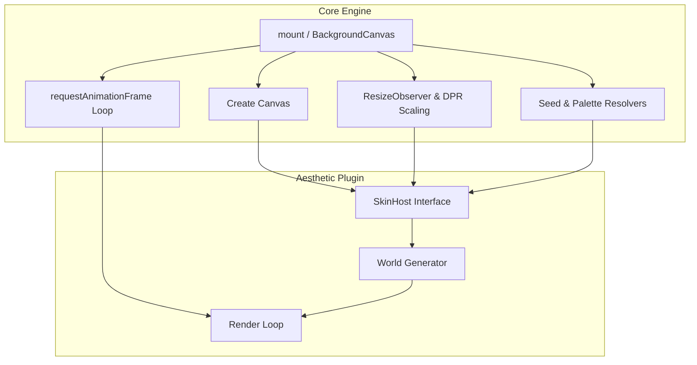

# Direction & Architecture

The Aesthetic Background Engine is a tool for dropping premium, generative, interactive backgrounds into any web project. 

The original aesthetic—a sci-fi sector extracted from a landing page (`void-tactical`)—is just the default "skin". **The true product is the engine itself:** a highly generalizable framework that handles all the tedious boilerplate of canvas backgrounds (resizing, DPR scaling, requestAnimationFrame loops, detail budgets, seeded PRNG) so developers can focus purely on aesthetics.

Local notes that must never ship: `docs/PRIVATE.md` (gitignored).

---

## The Vision: A Community of Aesthetics

Creating a custom canvas background is often too much work for a standard web project. This engine changes that by providing a robust host environment. 

The goal is to build an open-source ecosystem where anyone can write and share cool aesthetics (skins). Whether you want a calm drifting gradient, a brutalist ASCII terminal, a particle network, or abstract generative art, the engine handles the mounting, while the skin just handles the drawing.

---

## Architecture: Host vs. Skin

The architecture cleanly separates the plumbing from the art.



**The Host (`core`)**
- Manages the `canvas` element, DOM injection, and container-aware sizing (`ResizeObserver` with a window fallback).
- Runs the `requestAnimationFrame` loop, throttled to a `targetFps`.
- Provides the skin with a deterministic PRNG (`rng`), canvas context (`ctx`), resolved palette tokens (`palette`), and the parsed configuration (budget, seed).
- Resolves skins by object or by registered string id (`registerSkin`), so JSON configs and the `<bg-engine>` element can pick skins.

**The Skin (`skins/*`)**
- Implements the simple `BackgroundSkin` interface.
- Owns its internal state, entities, and drawing logic.
- Can accept arbitrary `options` extending the generic `<SkinOptions>` type for custom aesthetic knobs.
- May implement the optional `layers(root, context)` hook to add DOM layers (CSS gradients, SVG textures, grain) behind its canvas. Otherwise it knows nothing about React, Web Components, or the DOM.

---

## Conceptual Primitives

To truly understand the engine's generalizability, it is built on a few core mechanisms:

1. **Deterministic PRNG**: The engine replaces `Math.random()` with a Mulberry32 seeded generator. If two users pass `seed="orion"`, they generate the exact same constellation, network, or particle *layout*, regardless of their browser. Frame-by-frame animation of the default skin is not yet deterministic (it still reads wall-clock time); an injectable clock is planned in the roadmap's M1.
2. **DOM Isolation**: The engine creates an absolute/fixed positioned `<div class="bg-engine-root">` with `pointer-events: none`. The background renders behind your content without interfering with clicks, scrolls, or layout.
3. **Hardware Acceleration**: Heavy ambient effects (SVG turbulence, radial gradients, CSS grids) are offloaded to DOM layers. A skin injects them through its optional `layers(root, context)` hook and `mount()` places them underneath the canvas, relying on GPU-composited CSS rather than the Canvas 2D context.
4. **Generic Configuration**: The engine defines global budgets (`density`, `detail`, `cameraSpeed`); every skin can define its own schema via the `<T>` generic (e.g., `options: { maxNodes: 100 }`), flowing down from the React wrapper, the Vanilla mount function, or the element. `detail` and the overlay budgets are still HUD-flavored leftovers from the default skin and are slated to move into it.
5. **Palette as values**: Skins receive resolved palette tokens on `host.palette` rather than reading CSS variables. The host also writes the tokens as CSS variables for CSS layers; today those land on `:root` under generic names, which the roadmap replaces with engine-scoped variables.

---

## Custom Skins & Generative AI

The `BackgroundSkin` interface is intentionally minimal:

```ts
export type SkinHost<T = Record<string, unknown>> = {
  canvas: HTMLCanvasElement;
  ctx: CanvasRenderingContext2D;
  rng: Rng;
  config: ResolvedBackgroundConfig;
  palette: Palette;
  options?: T;
};

export type BackgroundSkin<T = Record<string, unknown>> = {
  id: string;
  mount(host: SkinHost<T>): SkinInstance;
  /** Optional DOM layers behind the canvas. Return a cleanup. */
  layers?(root: HTMLElement, context: { config; palette; options?: T }): () => void;
};
```

This simplicity makes the engine incredibly powerful when combined with **Generative AI**. Because the contract is so strict and isolated, LLMs are excellent at writing new skins from scratch in a single shot.

### Example LLM Prompt for Creating a New Skin

> "Write a new skin for an aesthetic background engine. The engine provides a `SkinHost` object which contains `{ canvas, ctx, rng, config, options }`. I need you to implement the `BackgroundSkin` interface which requires an `id` and a `mount(host)` function. `mount` must return an object with `resize(viewport)`, `frame(timestamp)`, and `destroy()` methods.
> 
> The aesthetic I want is: [DESCRIBE YOUR AESTHETIC HERE, e.g., a retro-futuristic synthwave grid].
> 
> Use the provided `rng()` (which returns a number between 0 and 1) instead of `Math.random()` to ensure deterministic generation. Read colors from `host.palette` (`accent`, `accentRgb`, `ink`, `bg`) instead of hardcoding them. Treat the difference between successive `frame(timestamp)` values as elapsed time rather than assuming 60 fps. Only return the TypeScript code for the skin."

A fuller authoring kit (scaffold, check command, questionnaire-driven skill) is planned; see [ROADMAP.md](ROADMAP.md).

---

## Sequence & Roadmap

1. **Extraction & Abstraction**: Pull the original `void-tactical` code out of the legacy codebase, establish the `BackgroundSkin` interface, and build the generic host. *(Done)*
2. **Packaging**: Create zero-dependency publishable targets for Vanilla, React, and Web Components. *(Done)*
3. **Skin Isolation**: Move any remaining `void-tactical` specific files (like `AmbientOverlays` and CSS) fully inside the `skins/void-tactical/` directory so the core engine remains strictly theme-agnostic. *(Done)*
4. **Validation Skins**: Write secondary skins (`drifting-dust`, a particle network) with custom generic options schemas to prove the interface. *(Done)*
5. **Ecosystem & Matrix Rain**: Build a classic text-rendering skin (`matrix-rain`) to prove font/grid capabilities. *(Done)*
6. **Repair the drop-in path (ROADMAP M0)**: Container-aware sizing, injected layer stack for `mount()` and `<bg-engine>`, skin registry with string ids, palette values on the host, generated type declarations, honest README. *(Done 2026-09-26)*
7. **Host contract v2 (ROADMAP M1)**: Injectable clock and `dt`-based motion, reduced-motion policy, visibility pause, scoped palette variables, pointer/noise inputs, core decoupled from the default skin, per-skin subpath exports.
8. **Layers, primitives, presets (ROADMAP M2–M3)**: Composable layer model, a standard layer library, and the aesthetic bar (contrast ceiling, palette coherence, flagship presets).
9. **Publishing and the authoring kit (ROADMAP M4)**: Refine the documentation, ship the scaffold and skill, and publish to encourage the community to build and share skins.
